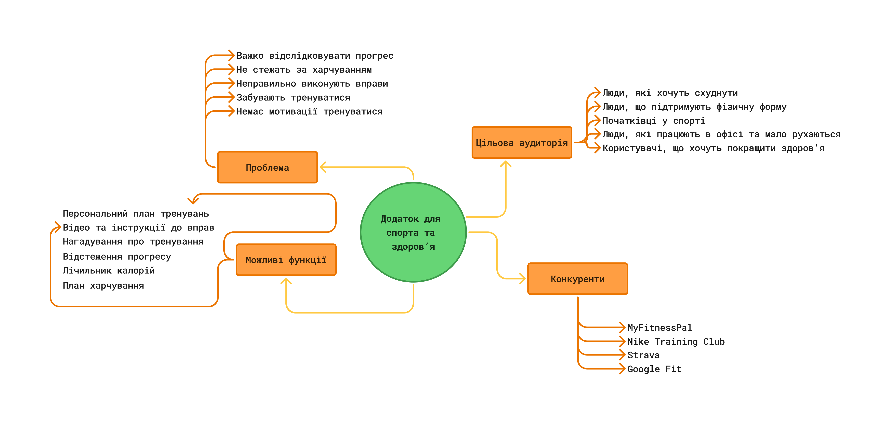

# Лабораторна робота №3  
## **Тема: “Знайомство з Figma та FigJam та визначення теми комплексного проєкту”**

---

## **Мета роботи:** 

1. Ознайомитися з можливостями Figma та FigJam (реєстрація під студентським акаунтом).  
2. Навчитися розрізняти інструменти для візуального дизайну та інструменти для досліджень.

---

## **Матеріальне забезпечення занять:**

1. Персональний комп'ютер, доступ до мережі Інтернет  
2. Обліковий запис Google  
3. Середовища Figma та FigJam.

---

## **Короткі теоретичні відомості:**  

**FigJam** — це онлайн-дошка для ідей, стікерів, схем та мозкового штурму (ідеально для етапів 1-3 дизайн-процесу). FigJam — інструмент для:

* мозкового штурму  
* досліджень  
* CJM  
* інтерв’ю  
* user flow  
* командної співпраці

**Figma** — інструмент для точного UI-дизайну, створення вайрфреймів та інтерактивних прототипів (етап 4 дизайн-процесу).  

Етап 1 — Empathy (Співпереживання, дослідження) дизайн-процесу - це дослідження реального стану речей. Ми не вигадуємо проблеми, а шукаємо їх через інтерв'ю та спостереження. UX не починається з малювання. Він починається з питання: ***“Для кого ми це робимо?”***  

Інструменти етапу Empathy:

* Domain Research  
* User Interview  
* Field Observation

---

## **Завдання для попередньої підготовки**

### **1. Розглянути матеріали лекції №3**

### **2. Зробіть короткий словник (5-7 термінів) базових понять англ. мовою**

| TERM | DEFINITION |
|------|------------|
| **UX designer** | a professional who designs the user experience of a product, focusing on usability, functionality, and how users interact with it to ensure it is easy and satisfying to use |
| **Figma** | a cloud-based design and prototyping tool used for creating user interfaces and collaborating on design projects in real time |
| **FigJam** | an online collaborative whiteboard tool by Figma used for brainstorming, planning, and team workshops |
| **User Interview** | a research method where designers talk directly with users to understand their needs, behaviors, and problems |
| **User Stories** | short, simple descriptions of a feature written from the user’s perspective, explaining what they need and why |
| **Brainstorming** | a creative technique where individuals or teams generate many ideas quickly to solve a problem or develop new concepts |
| **Test** | a method of evaluating a product, system, or feature to check its performance, usability, or correctness |

---

### **3. Дайте відповіді на наступні питання**

**1. Яка головна різниця між Figma та FigJam (для яких завдань кожен інструмент кращий)?**  
Figma - для створення інтерфейсів, прототипів і дизайн-систем. FigJam - для брейнштормів, воркшопів, мапінгу ідей та командної співпраці на етапі дослідження.

**2. Що таке "Двері Нормана" і як це поняття пов'язане з емпатією до користувача?**  
«Двері Нормана» - це приклад поганого дизайну, коли незрозуміло, як користуватися об’єктом (штовхати чи тягнути), описаний Don Norman. Це про відсутність емпатії: дизайн має бути інтуїтивним і враховувати очікування користувача.

**3. Поясніть різницю між Domain Research та User Interview.**  
Domain Research - це дослідження ринку, галузі та контексту проблеми. User Interview - це пряме спілкування з користувачами для розуміння їхніх потреб і поведінки.

**4. Чому на етапі дослідження важливо ставити питання "Чому?", а не просто фіксувати відповіді "Так/Ні"?**  
Питання «Чому?» допомагає зрозуміти мотивацію та глибинні причини поведінки, а не лише поверхневі факти.

**5. Чому UX-процес не починається з дизайну кнопок?**  
Бо спочатку потрібно зрозуміти проблему, користувачів і контекст. Без дослідження дизайн кнопок може вирішувати неправильну задачу.

**6. Що станеться з проєктом, якщо пропустити етап Empathy?**  
Продукт може не відповідати реальним потребам користувачів, що призведе до поганого досвіду та провалу проєкту.

---

## **Хід роботи**

### **Практичне завдання №1. Знайомство з Figma та FigJam (базовий рівень)**

1. Створіть акаунт у Figma (бажано через Google-пошту). Подайте заявку на Student Education Plan (це дасть безкоштовний доступ до професійних функцій).  
2. Створити по одному файлу у Figma та у FigJam  
3. Порівняти можливості інструментів:

| Критерій | Figma | FigJam |
|----------|-------|--------|
| Основне призначення | Дизайн інтерфейсів, створення прототипів | Онлайн-дошка для брейнштормів, планування, досліджень |
| Компоненти | Повноцінні UI-компоненти, дизайн-системи | Прості візуальні елементи (стікери, фігури, стрілки) |
| Прототипування | Підтримує інтерактивні прототипи | Не призначений для прототипування |
| Sticky notes | Відсутні або обмежено | Повноцінна підтримка стікерів для командної роботи |
| Дослідження | Менш підходить для спільного дослідження, більше для дизайну | Ідеальний для дослідницьких сесій та збору ідей |

Висновок:  
На етапі дослідження - у **FigJam** (для брейнштормів, збору ідей, нотаток).  
На етапі UI-дизайну - у **Figma** (для створення інтерфейсів і прототипів).

---

### **Практичне завдання №2. Формування ідеї семестрового проєкту (середній рівень)**  
Додаток для спорту та здоров’я

---

### **Практичне завдання №3. Етап Empathy (підвищений рівень)**  

---

## **Контрольні запитання**

**Що таке Empathy в UX?**  
Empathy в UX — це глибоке розуміння користувача, його потреб, проблем і реального досвіду взаємодії з продуктом. Дизайнер не вигадує рішення, а спирається на дослідження поведінки людей, щоб створити продукт, який дійсно вирішує їхні задачі.

**Чому UX-дизайнер досліджує поведінку, а не думки?**  
Тому що люди часто говорять одне, а роблять інше. Поведінка показує реальні дії користувача, його труднощі та звички, тоді як думки можуть бути неточними або соціально бажаними. Саме дії дають об’єктивні дані для проєктування.

**Чим відрізняється інтерв’ю від спостереження?**  
Інтерв’ю — це розмова з користувачем, під час якої дизайнер дізнається про його досвід, проблеми та мотивацію через відповіді на запитання. Спостереження — це аналіз реальної поведінки людини в природному середовищі без активного втручання, що дозволяє побачити, як вона діє насправді.

---

# **Висновок**

Під час виконання лабораторної роботи я ознайомився з можливостями Figma та FigJam та зрозумів різницю між інструментами для дослідження і для створення інтерфейсів. Практичні завдання допомогли усвідомити важливість етапу Empathy у дизайн-процесі та необхідність глибокого розуміння потреб користувачів перед початком проєктування. Отримані знання стануть основою для подальшої роботи над комплексним семестровим проєктом.
