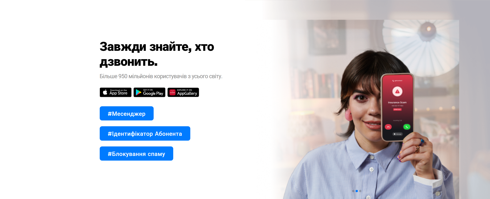
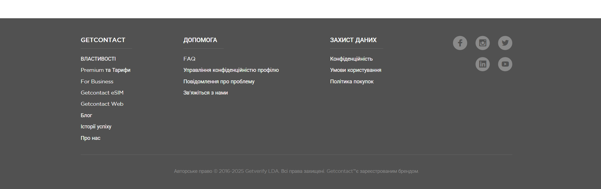
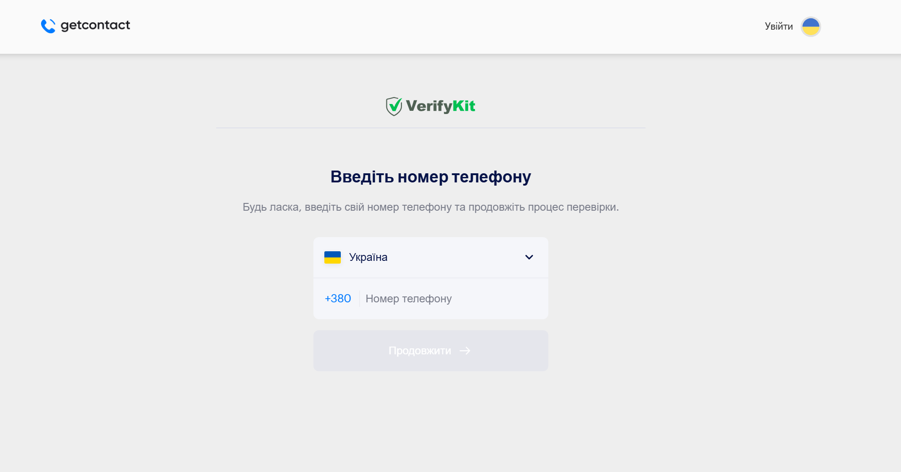
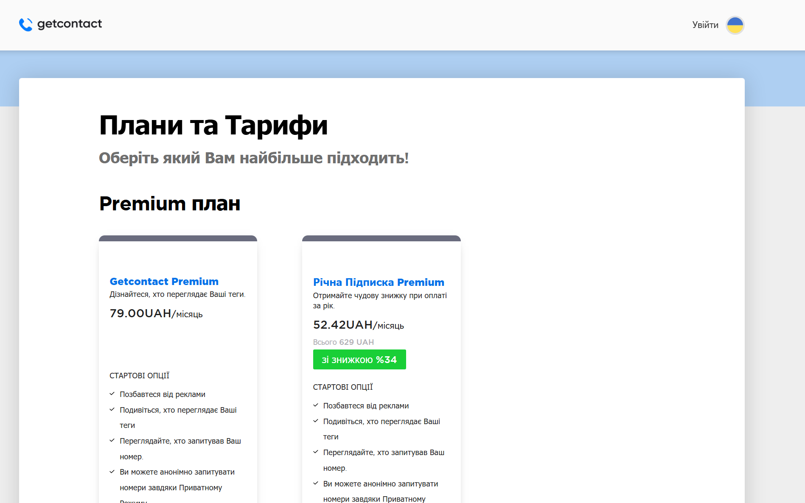
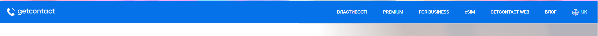
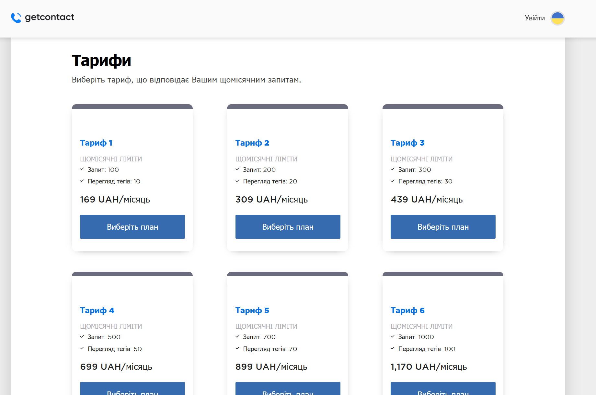
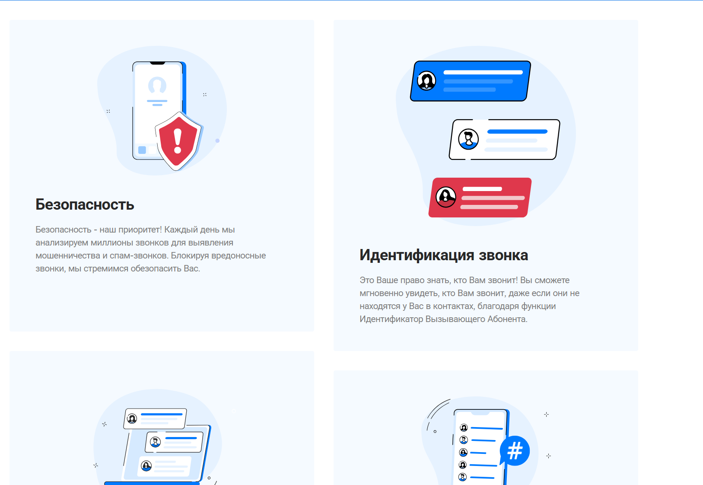
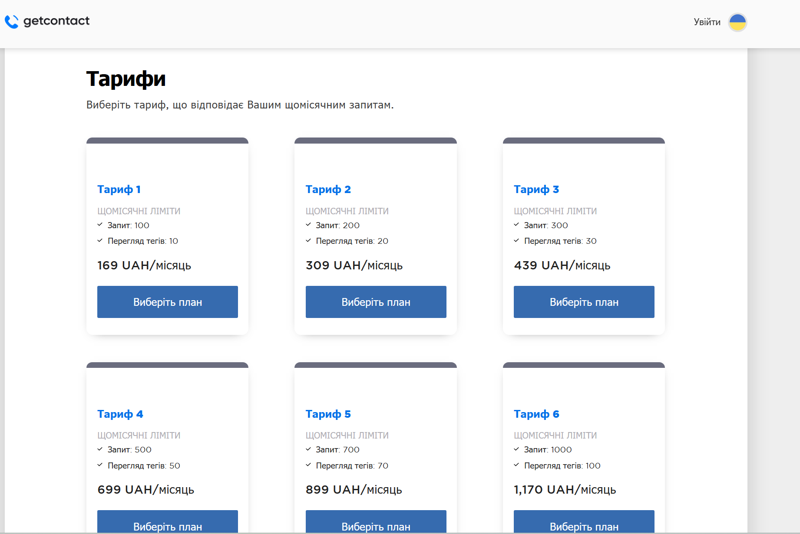
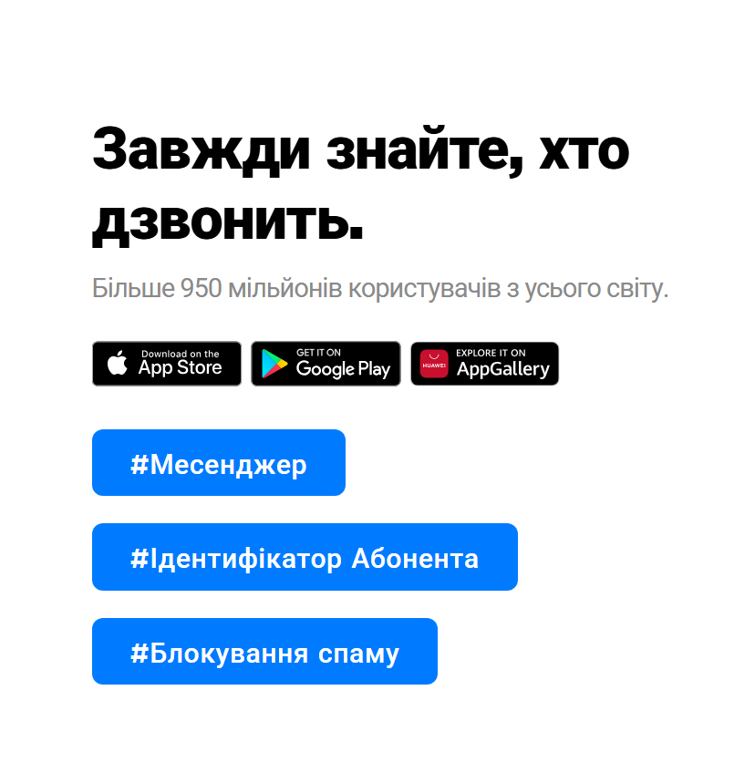

# СРС_Лекція_6
---
## GetContact

# Аналіз композиції на сайті Getcontact

У цьому розділі проводимо дослідження типів композиції на сторінках сайту Getcontact. Розглядаємо відкриту/закриту, симетричну/асиметричну та статичну/динамічну композицію.

## Сторінки для аналізу

1. [Головна сторінка](https://getcontact.com/uk/)
2. [Сторінка властивостей (Features)](https://getcontact.com/ru/features)
3. [Сторінка Premium / Тарифи](https://premium.getcontact.com/uk/)
4. [Сторінка «Увійти» / Login](https://premium.getcontact.com/uk/login)

## Критерії аналізу композиції

### 1. Відкрита / Закрита композиція
- **Відкрита** — елементи сторінки «виходять за межі» центральної структури, створюють відчуття простору.
- **Закрита** — блоки чітко обмежені рамками або центральним розташуванням, погляд користувача утримується всередині структури.

**Приклади на Getcontact:**
- Головний банер та верхнє меню: **закрита композиція** (центральний блок).
  
  
  
- Нижні текстові секції з іконками: **відкрита композиція** (елементи мають простір по боках).  

  

### 2. Симетрична / Асиметрична композиція
- **Симетрична** — елементи збалансовані навколо центру.
- **Асиметрична** — важкі елементи зміщені в одну сторону, баланс досягається кольором, розміром або повторюваними елементами.

**Приклади на Getcontact:**
- Блок авторизації та меню: **симетрична** (дзеркальна структура).  

- Блоки тарифів: **асиметрична** (зміщені по ширині та висоті).  

### 3. Статична / Динамічна композиція
- **Статична** — елементи розташовані рівномірно, без нахилів або напрямних.
- **Динамічна** — присутні діагоналі, зміщені елементи, ритм повторюваних об'єктів, що створює відчуття руху.

**Приклади на Getcontact:**
- Верхні блоки меню та логотип: **статична композиція** (рівномірне розташування).  

 
- Блоки тарифів з іконками: **динамічна композиція** (шахове розташування елементів, кольорові акценти).  

# Аналіз типів гармонізації композиції на сайті Getcontact

У цьому розділі розглядаємо типи гармонізації композиції, які застосовані на сторінках сайту Getcontact. Для кожного методу додається скріншот та короткий опис.

## Типи гармонізації композиції

### 1. Колірна гармонія
- Використання узгоджених кольорів для створення візуальної єдності та комфорту сприйняття.
- На сайті Getcontact кольори банерів, кнопок та іконок підібрані так, щоб виділяти важливі елементи, при цьому не порушуючи загальний баланс.

### 2. Пропорційна гармонія
- Баланс розмірів елементів, щоб вони не перевантажували сторінку та виглядали гармонійно.
- Приклад: блоки тарифів однакового розміру та висоти, що створює відчуття організованості.

### 3. Ритмічна гармонія
- Повторення елементів у певному ритмі для створення цілісності та зорового порядку.
- На сайті використовується ритм у розташуванні іконок, картинок та текстових блоків, що створює плавне сприйняття сторінки.

### 4. Контрастна гармонія
- Використання контрастних елементів для підкреслення важливих деталей.
- Приклад: світлий текст на темному фоні, яскраві кнопки на нейтральному фоні, що привертають увагу.

### 5. Природна гармонія (симетрія/асиметрія)
- Використання симетричних та асиметричних блоків для створення природного балансу та зручного читання.
- Симетричні меню та блоки авторизації забезпечують стабільність, асиметричні блоки тарифів додають динаміки.

