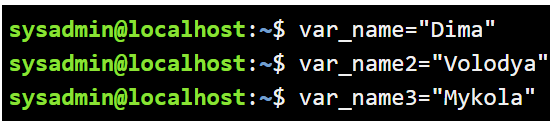
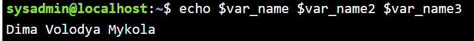
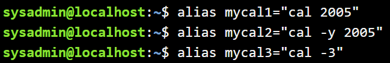
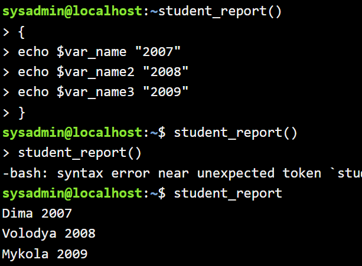
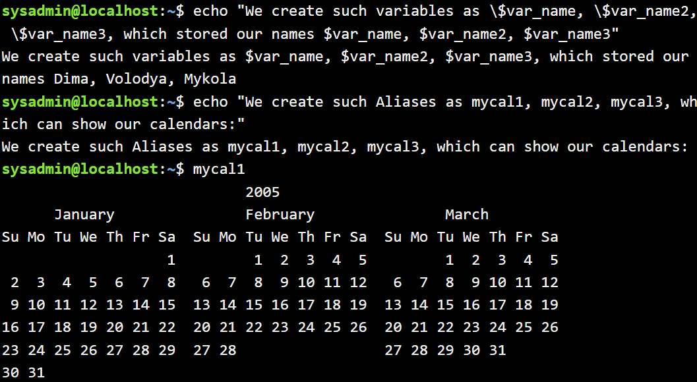
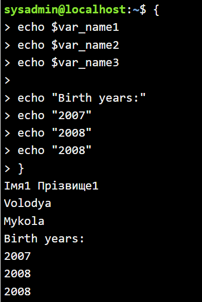
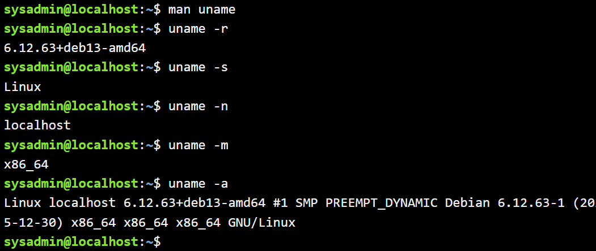

# Лабораторна робота №3

# Тема: “Знайомство з базовими командами CLI-режиму в Linux”

---

## Мета роботи

1. Знайомство з базовими командами CLI-режиму в Linux.  
2. Знайомство з базовими текстовими командами в термінальному режимі роботи в різних ОС.

---

## Матеріальне забезпечення занять

1. ЕОМ типу IBM PC.  
2. ОС сімейства Windows та віртуальна машина Virtual Box (Oracle).  
3. ОС GNU/Linux (будь-який дистрибутив).  
4. Сайт мережевої академії Cisco netacad.com та його онлайн курси по Linux

---

## Завдання для попередньої підготовки

1. *Прочитайте короткі теоретичні відомості до лабораторної роботи та зробіть невеликий словник базових англійських термінів з питань призначення команд та їх параметрів.  

2. Вивчіть матеріали онлайн-курсу академії Cisco “NDG Linux Essentials”:  
- Chapter 5 - Command Line Skills  
- Chapter 6 - Getting Help  

3. Пройдіть тестування у курсі NDG Linux Essentials за такими темами:  
- Chapter 05 Exam  
- Chapter 06 Exam  

4. *Дайте визначення наступним поняттям:*

**Командний інтерпретатор** - це програмний компонент операційної системи, який приймає введені користувачем команди, аналізує їх та передає системі для виконання. Він забезпечує взаємодію користувача з операційною системою через текстовий інтерфейс.

**Оболонка (Shell)** - це програма, що забезпечує інтерфейс між користувачем і ядром операційної системи. Вона дозволяє вводити команди, запускати програми, працювати з файлами та керувати процесами. Найпоширенішою оболонкою в Linux є Bash.

**Команда** - це інструкція, яку користувач вводить у терміналі для виконання певної дії (перегляд файлів, створення директорій, запуск програм тощо). Команди можуть бути вбудованими або зовнішніми.

---

5. **Дайте відповіді на наступні питання:**

**Яку базову інформацію надає рядок запрошення prompt?**  
Рядок запрошення (prompt) зазвичай містить ім’я користувача, ім’я комп’ютера (хоста), поточний каталог та символ доступу ($ — звичайний користувач, # — суперкористувач). Він показує, що система готова приймати команди.

**Для чого команді потрібні параметри та аргументи?**  
Параметри (options) змінюють спосіб виконання команди, а аргументи вказують, з якими об’єктами потрібно працювати (файли, каталоги тощо). Вони дозволяють гнучко керувати роботою команди.

**Яке призначення команди ls, які параметри та аргументи вона може мати? Наведіть 3 приклади.**  
Команда `ls` використовується для перегляду вмісту каталогу.

Приклади:

- `ls` - показує файли та каталоги поточної директорії.
- `ls -l` - відображає детальну інформацію у довгому форматі.
- `ls -a` - показує всі файли, включаючи приховані.

**Яким чином можна використати історію команд, які переваги це надає?**  
Історію команд можна переглянути командою `history` або за допомогою клавіш зі стрілками вгору та вниз. Це дозволяє швидко повторити або відредагувати раніше введені команди без повторного набору.

**Яке призначення команди echo?**  
Команда `echo` використовується для виведення тексту або значення змінних у терміналі. Вона часто застосовується для перевірки змінних або виводу повідомлень у скриптах.

**Охарактеризуйте поняття змінної в оболонці Bash, які типи змінних вона підтримує?**  
Змінна в Bash — це іменована область пам’яті для зберігання значення. Bash підтримує локальні змінні (діють у межах поточної сесії або скрипта) та змінні оточення (доступні дочірнім процесам).

**Яке призначення команд env, export та unset?**  
`env` - відображає список змінних оточення.  
`export` - робить змінну доступною для дочірніх процесів.  
`unset` - видаляє змінну.

**Які команди для отримання довідки по командам в терміналі ви знаєте?**  
Для отримання довідки використовують `man`, `help`, `info`, а також параметр `--help` після команди.
6. Підготувати в електронному вигляді початковий варіант звіту:  
- Титульний аркуш, тема та мета роботи  
- Словник термінів  
- Відповіді на п.4 та п.5 з завдань для попередньої підготовки  

---

## Хід роботи

### 1. Опрацюйте всі приклади команд, що представлені у лабораторній роботі курсу NDG Linux Essentials - Lab 5: Command Line Skills та Lab 6: Getting Help. Створіть таблицю для опису цих команд

| Назва команди | Її призначення та функціональність |
|---------------|-----------------------------------|
| ls | Виводить інформацію про каталоги та файли. За замовчуванням без аргументів відображає вміст поточного каталогу. |
| ls -l | Відображає інформацію у довгому форматі: права доступу, власника, розмір файлу, дату зміни. |
| ls -l /tmp | Виводить детальну інформацію про файли та каталоги в директорії /tmp. |
| ls -r | Відображає файли у зворотному порядку сортування. |
| ls -lr | Поєднує довгий формат виводу та зворотний порядок сортування. |
| ls -lh | Показує розмір файлів у зручному для читання форматі (KB, MB, GB). |
| history | Відображає список раніше введених команд у поточній сесії. |
| cal | Виводить календар поточного місяця або зазначеного року. |
| echo | Виводить текст або значення змінних у терміналі. |
| grep | Використовується для пошуку тексту або шаблону у файлах чи виводі інших команд. |
| export | Робить змінну доступною для дочірніх процесів (створює змінну оточення). |
| alias | Створює псевдонім (скорочення) для команди або послідовності команд. |

**Примітка:** Скріншоти виконання команд в терміналі можна не представляти, достатньо коротко описати команди в таблиці.

---

### 2. Робота в терміналі (закріплення практичних навичок) обов'язково представити свої скріншоти:

#### 2.1. Робота зі змінними (Variables) та псевдонімами (Aliases) в терміналі:

- Створіть змінні, що будуть містити Ваші імена та прізвища $var_name1, $var_name2, $var_name3
  ```bash
  var_name="Dima"
  var_name2="Volodya"
  var_name3="Mykola"
  ```
    
- За допомогою команди echo виведіть імена студентів вашої команди
  ```bash
  echo $var_name $var_name2 $var_name3
  ```
    
- Створіть псевдоніми mycal1, mycal2, mycal3 для команди cal для автоматичного виведення календарю вашого року народження
  ```bash
  alias mycal1="cal 2005"
  alias mycal2="cal -y 2005"
  alias mycal3="cal -3"
  }
  ```
    

#### 2.2. *Робота з функціями (Functions) в терміналі:

- Створіть функцію students_report, що порядково буде виводити спочатку імена студентів Вашої команди, а потім роки їх народження
  ```bash
  student_report() {
  echo $var_name "2007"
  echo $var_name2 "2008"
  echo $var_name3 "2009"
  }
  ```
    

#### 2.3. *Робота з лапками (Quoting) в терміналі. Виведіть в командному рядку наступні речення:

- “We create such variables as $var_name1, $var_name2, $var_name3, which stored our names Name1, Name2, Name3”  
- “We create such Aliases as mycal1, mycal2, mycal3, which can show our calendars: Calendar1, Calendar2, Calendar3”
  ```bash
  echo "We create such variables as \$var_name, \$var_name2, \$var_name3, which stored our names $var_name, $var_name2, $var_name3"
  echo "We create such Aliases as mycal1, mycal2, mycal3, which can show our calendars:"
  ```
    

#### 2.4. **Робота з інструкціями керування (Control Statements) в терміналі:

- Чи можна завдання 2.1 та 2.2 ходу роботи виконати через інструкції керування без написання окремої функції, як це буде виглядати?
  ```bash
  {
  echo $var_name
  echo $var_name2
  echo $var_name3
  
  echo "Birth years:"
  echo "2007"
  echo "2008"
  echo "2008"
  }
  ```
    

#### 2.5. Робота з командами довідки (Man Pages) в терміналі:

- На прикладі команди uname продемонструйте як отримати довідку. На основі отриманої додаткової інформації наведіть 5 різних варіантів виводу результату інформації по даній команді з використанням 5 різних параметрів (Options)

  ```bash
  man uname
  uname -r
  uname -s
  uname -n
  uname -m
  uname -a
  ```
  
  

---

## Контрольні запитання

### 1. Які типи команд існують в оболонці Bash?

У Bash існують вбудовані команди (builtin), зовнішні команди (програми з файлової системи), функції оболонки та псевдоніми (alias). Також є зарезервовані слова, які використовуються в конструкціях керування.

### 2. Що таке змінні оточення? Які вони бувають. Як їх можна переглянути в терміналі?

Змінні оточення — це змінні, що зберігають інформацію про середовище роботи системи та доступні процесам. Вони бувають локальні (діють у межах поточної сесії) та глобальні (експортовані, доступні дочірнім процесам). Переглянути їх можна командами `env`, `printenv` або `set`.

### 3. Опишіть змінну $PS1. Як в терміналі переглянути її вміст?

Змінна PS1 визначає вигляд запрошення командного рядка в Bash. Вона може містити ім’я користувача, ім’я хоста, поточну директорію тощо. Переглянути її вміст можна командою `echo $PS1`.

### 4. Як можна змінити значення змінної $PS1? Що при цьому відбудеться в рядку запрошення в bash? Як змінити значення цієї змінної не на поточний сеанс, а за замовчуванням?

Змінити значення можна командою, наприклад: `PS1="MyPrompt$ "`. Після цього зміниться вигляд запрошення в поточній сесії. Щоб зробити зміну постійною, потрібно додати нове значення PS1 у файл `~/.bashrc` або `~/.bash_profile`.

### 5. Для чого використовують лапки в оболонці Bash?

Лапки використовують для керування інтерпретацією символів. Одинарні лапки `' '` повністю вимикають обробку змінних і спецсимволів, подвійні `" "` дозволяють підстановку змінних, а зворотний слеш `\` екранує окремий символ.

### 6. Для чого використовують інструкції керування, які їх види Ви знаєте?

Інструкції керування використовують для керування логікою виконання команд. До них належать умовні оператори `if`, `case`, цикли `for`, `while`, `until`, а також оператори керування виконанням `&&`, `||`.

### 7. В чому різниця якщо в кінці рядку запрошення bash стоїть символ $ чи #?

Символ `$` означає, що працює звичайний користувач. Символ `#` означає, що відкрито сесію суперкористувача (root), який має повні права доступу до системи.

### 8. Яке призначення команд whereis та locate? Яка між ними відмінність?

Команда `whereis` шукає розташування виконуваних файлів, вихідних кодів і man-сторінок у стандартних каталогах. Команда `locate` шукає файли за попередньо створеною базою даних по всій файловій системі. Відмінність у тому, що `locate` працює швидше, але залежить від актуальності бази даних, тоді як `whereis` шукає лише в стандартних шляхах.

---

## Conclusion

During this laboratory work, the basic concepts of the Linux command-line interface were studied. The roles of the command interpreter, shell, and commands were analyzed, as well as the structure of the prompt and the use of parameters and arguments. Special attention was paid to the `ls`, `echo`, `history`, `env`, `export`, and `unset` commands and their practical application in the terminal.

As a result of this work, practical skills in working with the Bash shell were developed, including using command history, working with variables, and obtaining help information in the terminal. The laboratory helped to better understand how the CLI environment functions and how it can be effectively used for system interaction and administration.
