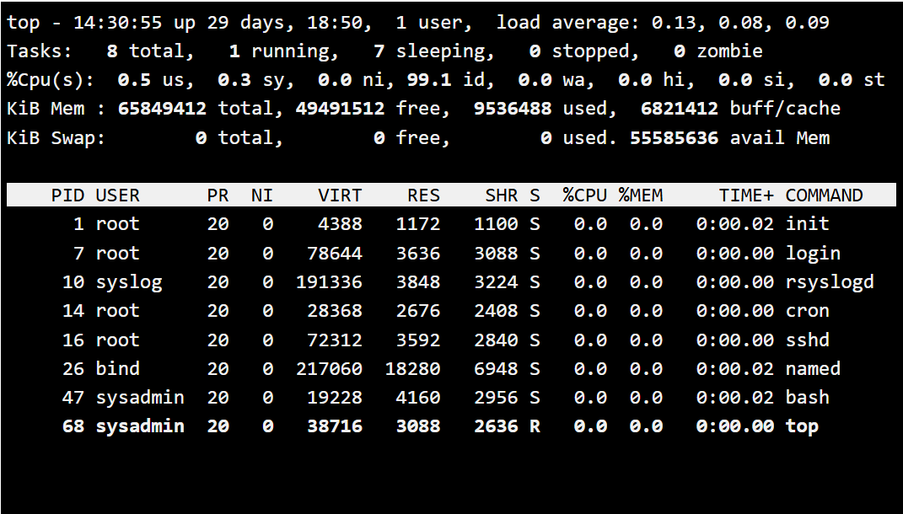

# **Лабораторна робота №4**

# **Тема: “Команди Linux для управління процесами”**

---

## **Мета роботи**

1. Отримання практичних навиків роботи з командною оболонкою Bash.  
2. Знайомство з базовими командами для управління процесами.

---

## **Матеріальне забезпечення занять**

1. ЕОМ типу IBM PC.  
2. ОС сімейства Windows та віртуальна машина Virtual Box (Oracle).  
3. ОС GNU/Linux (будь-який дистрибутив).  
4. Сайт мережевої академії Cisco netacad.com та його онлайн курси по Linux.

---

## **Завдання для попередньої підготовки**

### 1. *Прочитайте короткі теоретичні відомості до лабораторної роботи та зробіть невеличкий словник базових англійських термінів з питань призначення команд та їх параметрів.*

| TERM | DEFINITION |
|------|------------|
| Process | A process is a running instance of a program on the system. Each process has its own Process ID (PID) and system resources such as memory and CPU time. |
| ps Command | The `ps` command is a Linux utility used to display information about currently running processes. It provides details such as PID, CPU usage, memory usage, user ownership, and process state. |
| PID (Process ID) | PID is a unique numerical identifier assigned by the operating system to each running process. It is used to manage and control processes. |
| top Command | The `top` command is a real-time system monitoring tool that displays dynamic information about running processes, CPU usage, memory usage, load average, and system performance. |
| Load Average | Load average represents the system workload over 1, 5, and 15 minutes. Higher values indicate that the system is under heavier processing demand. |
| Signal | A signal is a predefined message sent to a process to control its behavior (e.g., stop, terminate, pause, or resume). Processes may respond to or ignore certain signals. |
| kill Command | The `kill` command is used to send signals to processes using their PID. By default, it sends the TERM signal to request a process to terminate. |

---

### 2. На базі розглянутого матеріалу дайте відповіді на наступні питання:

#### **2.1. Які команди для моніторингу стану процесів ви знаєте. Як переглянути їх можливі параметри?**

Основні команди для моніторингу процесів - це `ps` та `top`. Команда `ps` використовується для перегляду інформації про процеси в певний момент часу, а `top` - для моніторингу процесів у реальному часі. Переглянути можливі параметри можна за допомогою команд `ps --help`, `man ps`, `man top` або `top --help`.

#### **2.2. Чи може команда ps у реальному часі відслідковувати стан процесів?**

Ні, команда `ps` не працює в реальному часі. Вона відображає інформацію про процеси лише на момент виконання команди. Для відслідковування процесів у реальному часі використовується команда `top`.

#### **2.3. За якими параметрами можливе сортування процесів в команді top? Як переключатись між ними?**

У команді `top` процеси за замовчуванням сортуються за показником `%CPU`. Сортування можна змінювати за різними полями, такими як `%CPU`, `%MEM`, `PID`, `TIME+` та іншими. Для вибору поля сортування потрібно натиснути клавішу `f` під час роботи `top`, а для зміни інтервалу оновлення - клавішу `d`.

#### **2.4. Які команди для завершення роботи процесів ви знаєте?**

Для завершення процесів використовуються команди `kill` та `killall`. Команда `kill` надсилає сигнал процесу за його PID (наприклад, TERM або KILL), а команда `killall` дозволяє завершити процеси за їхньою назвою.

---

## **Хід роботи**

### 1. Початкова робота в CLI-режимі в Linux ОС сімейства Linux:

1. Запустіть операційну систему Linux Ubuntu. Виконайте вхід в систему та запустіть термінал (якщо виконуєте ЛР у 401 ауд.).  
2. Запустіть віртуальну машину Ubuntu_PC (якщо виконуєте завдання ЛР через академію netacad).  
3. Запустіть свою операційну систему сімейства Linux (якщо працюєте на власному ПК та її встановили) та запустіть термінал.

---

### 2. Дайте відповіді на наступні питання:

#### **1. Як вивести вміст директорії /proc? Де вона знаходиться та для чого призначена? Охарактеризуйте інформацію про її вміст.**

Вміст можна переглянути командою `ls /proc`. Директорія `/proc` знаходиться в корені файлової системи Linux. Вона є віртуальною файловою системою, яка містить інформацію про процеси та стан ядра. У ній є папки з номерами PID (інформація про процеси), а також файли з даними про CPU, пам’ять, uptime тощо.

#### **2. Як вивести інформацію про поточні сеанси користувачів? Якою командою це можна зробити?**

Інформацію про активні сеанси можна переглянути командами `who`, `w` або `users`.

#### **3. Які дії можна зробити в терміналі за допомогою Ctrl + C, Ctrl + D та Ctrl + Z?**

Ctrl + C - примусово перериває виконання процесу.  
Ctrl + D - завершує введення або виходить із оболонки.  
Ctrl + Z - призупиняє процес і переводить його у фоновий режим (stopped).

#### **4. Чим відрізняється фоновий процес від звичайного. Де вони використовуються?**

Звичайний (foreground) процес займає термінал і блокує введення до завершення. Фоновий (background) процес працює без блокування терміналу. Фонові процеси використовуються для довготривалих задач, серверів або служб.

#### **5. Опишіть команди jobs, bg, fg.**

`jobs` - показує список фонових і призупинених задач у поточній оболонці.  
`bg` - відновлює призупинену задачу у фоновому режимі.  
`fg` - переводить фонову або призупинену задачу в активний (foreground) режим.

#### **6. Якою командою можна переглянути інформацію про запущені в системі фонові процеси та задачі?**

Для перегляду задач оболонки використовується `jobs`, а для всіх процесів у системі - `ps` або `top`.

#### **7. Як призупинити фоновий процес, як його потім відновити та при необхідності перезапустити?**

Призупинити можна за допомогою `Ctrl + Z` або команди `kill -STOP PID`.  
Відновити - командою `bg` (у фоні) або `fg` (у передньому режимі) чи `kill -CONT PID`.  
Перезапустити - потрібно завершити процес (`kill PID`) і запустити його знову вручну.

---

### 3. Запустіть термінал, та в командному рядку виконайте наступні дії для ознайомлення з роботою з процесами:

- запустіть команду top, проаналізуйте отриманий в цій команді результат та охарактеризуйте найбільш активні процеси у системі;

Після запуску команди `top` видно, що система працює стабільно. Час безперервної роботи становить 29 днів 18 годин, у системі працює 1 користувач. Показники load average (0.13, 0.08, 0.09) дуже низькі, що свідчить про мінімальне навантаження на систему.

У системі запущено 8 процесів: 1 у стані running і 7 у стані sleeping, зомбі-процеси відсутні. Завантаження процесора майже нульове - 99.1% часу CPU перебуває в режимі простою (idle). Це означає, що система практично не навантажена.

Оперативної пам’яті доступно багато: із приблизно 6.5 ГБ використовується лише близько 953 МБ, решта - вільна або використовується під кеш. Swap-пам’ять не використовується.

- призупинити виконання команди top (треба використати комбінацію клавіш);
- вивести інформацію про процеси за допомогою команди ps;
СКРІН

- *наведіть 5 прикладів з використанням різних параметрів команди ps (наприклад, вивести тільки системні процеси, вивести процеси конкретного користувача, вивести дерево процесів тощо). Опишіть, що саме роблять обрані Вами параметри

1. ps -ef  
Виводить усі процеси в системі у повному форматі.  
Параметр -e показує всі процеси, а -f додає розширену інформацію (UID, PID, PPID, час запуску, команду).

2. ps -u sysadmin  
Показує процеси конкретного користувача.  
Параметр -u фільтрує процеси за ефективним користувачем.

3. ps -A  
Виводить усі процеси в системі.  
Параметр -A аналогічний -e - показує всі активні процеси.

4. ps -l  
Виводить процеси у довгому форматі.  
Параметр -l додає детальну інформацію: стан процесу (S), пріоритет (PRI), nice-значення (NI) тощо.

5. ps -H  
Показує дерево процесів у ієрархічному вигляді.  
Параметр -H відображає зв’язок між батьківськими та дочірніми процесами.

- **передивіться чи є у Вас запущені фонові процеси, які саме?**
СКРІН

- **відновити виконання призупиненого фонового процесу спочатку у позиції “на передньому плані” (foreground), потім ще раз його призупинити, а потім відновити його виконання у позиції “на задньому плані” (background)**
СКРІН

- завершити роботу даного фонового процесу.
СКРІН

---

## **Контрольні запитання**

### **1. Яке призначення директорії /proc в системах Linux. Яку інформацію вона зберігає?**

/proc - це віртуальна файлова система, що містить інформацію про поточні процеси та стан ядра. Вона зберігає дані про PID процесів, використання CPU, пам’ять, uptime, параметри ядра та системні ресурси.

### **2. Як серед будь-яких трьох процесів динамічно визначати, який з них використовує найбільший обсяг пам’яті? Який відсоток пам’яті він споживає?**

Для цього використовується команда `top` або `htop`. У стовпці `%MEM` відображається відсоток використаної пам’яті. Процес із найбільшим значенням `%MEM` споживає найбільший обсяг пам’яті.

### **3. Як отримати ієрархію батьківських процесів у Linux? Наведіть її структуру та охарактеризуйте.**

Ієрархію можна отримати командою `ps -H` або `pstree`. Структура має вигляд дерева: на вершині знаходиться процес `init` (PID 1), від нього запускаються дочірні процеси, які можуть мати власні підпроцеси.

### **4. Чим відрізняється команда top від ps?**

`ps` показує стан процесів у конкретний момент часу, а `top` відображає процеси в реальному часі з автоматичним оновленням інформації.

### **5. Які додаткові можливості реалізує htop у порівнянні з top?**

`htop` має зручний кольоровий інтерфейс, підтримує прокрутку списку, дозволяє керувати процесами мишкою та змінювати сортування без введення складних команд.

### **6. Компоненти iOS для моніторингу процесів**

В iOS моніторинг процесів здійснюється через системні засоби: розділ Settings - Battery (показує використання ресурсів додатками), App Switcher (перегляд активних програм), а також системний менеджер пам’яті, який автоматично керує фоновими процесами. Для розробників використовується інструмент Xcode Instruments, що дозволяє детально аналізувати CPU та пам’ять.

### **7. Чи підтримує iOS термінальне керування процесами?**

Стандартна iOS не підтримує повноцінне термінальне керування процесами для користувача. Доступ до системних процесів обмежений з міркувань безпеки. Термінальне керування можливе лише на пристроях із jailbreak або через інструменти розробника (Mac + Xcode).

### **8. Чи можна встановити сторонні програми для моніторингу процесів?**

Так, в App Store є додатки для моніторингу використання батареї, пам’яті та продуктивності (наприклад системні монітори). Однак вони мають обмежений доступ до системних процесів через політику безпеки Apple і не дозволяють повністю керувати ними.

---

## **Висновки за результатами роботи**

Під час виконання лабораторної роботи було отримано практичні навики роботи з командною оболонкою Bash та розглянуто основні команди для управління процесами в Linux. Було досліджено роботу команд ps, top, kill, killall, а також механізми керування фоновими та передніми процесами. Отримані знання дозволяють здійснювати моніторинг стану системи, аналізувати навантаження та керувати процесами в середовищі Linux.
