# **Лабораторна робота №5**

# **Тема: “Знайомство з командами навігації по файловій системі та керування файлами та каталогами”**

---

## **Мета роботи:** 

1. Отримання практичних навиків роботи з командною оболонкою Bash.  
2. Знайомство з базовими командами навігації по файловій системі.  
3. Знайомство з базовими командами для керування файлами та каталогами.

---

## **Матеріальне забезпечення занять:**  

1. ЕОМ типу IBM PC.  
2. ОС сімейства Windows та віртуальна машина Virtual Box (Oracle).  
3. ОС GNU/Linux (будь-який дистрибутив).  
4. Сайт мережевої академії Cisco netacad.com та його онлайн курси по Linux.

---

## **Завдання для попередньої підготовки:**

### **1. Прочитайте короткі теоретичні відомості до лабораторної роботи та зробіть невеликий словник базових англійських термінів з питань призначення команд та їх параметрів.**

| English term | Український відповідник | Пояснення |
|---|---|---|
| file | файл | Іменована одиниця збереження даних у файловій системі |
| directory | каталог | Папка, що містить файли та інші каталоги |
| path | шлях | Адреса розташування файлу або каталогу |
| current directory | поточний каталог | Каталог, у якому зараз працює користувач |
| root directory | кореневий каталог | Початковий каталог файлової системи Linux `/` |
| home directory | домашній каталог | Особистий каталог користувача |
| hidden file | прихований файл | Файл, ім’я якого починається з крапки |
| command | команда | Інструкція, яку виконує оболонка Bash |
| option | параметр | Додатковий ключ команди, що змінює її поведінку |
| argument | аргумент | Дані, які передаються команді |
| terminal | термінал | Програма для роботи з командним рядком |
| shell | командна оболонка | Середовище для введення і виконання команд |
| navigate | навігація | Переміщення по файловій системі |
| create | створити | Дія зі створення файлу або каталогу |
| copy | копіювати | Створення дубліката файлу або каталогу |
| move | перемістити | Перенесення файлу або каталогу в інше місце |
| rename | перейменувати | Зміна імені файлу або каталогу |
| delete | видалити | Видалення файлу або каталогу |
| recursive | рекурсивний | Дія, що виконується для каталогу та всього його вмісту |
| permissions | права доступу | Правила доступу до файлу або каталогу |

---

### **2. На базі розглянутого матеріалу дайте відповіді на наступні питання:**

#### **1. Порівняйте файлові структури Windows-подібної та Linux-подібної системи**

Файлова структура Windows-подібної системи базується на використанні декількох логічних дисків, які позначаються літерами (C:, D:, E: тощо). Кожен диск має власну кореневу директорію, від якої починається ієрархія каталогів. Системні файли зазвичай розміщені у каталогах **Windows**, **Program Files**, **Users**. Користувацькі файли знаходяться в каталозі **Users**, де для кожного користувача створюється окрема папка. Така структура є відносно незалежною для кожного диска.

У Linux-подібних системах використовується єдина ієрархічна файлова система, яка починається з кореневого каталогу **/**. Усі інші каталоги є його підкаталогами. Додаткові пристрої та розділи дисків підключаються до цієї структури через механізм монтування. Основні системні каталоги мають стандартизоване призначення, наприклад **/bin**, **/etc**, **/home**, **/usr**, **/var**. Такий підхід забезпечує більш уніфіковану та передбачувану організацію файлової системи.

---

#### **2. Розкрийте поняття FHS. Як даний стандарт використовується в контексті файлових систем?**

**FHS (Filesystem Hierarchy Standard)** — це стандарт, який визначає структуру каталогів у Linux-подібних операційних системах та їх призначення. Він описує, які каталоги повинні існувати в системі та які типи файлів у них повинні зберігатися.

Метою FHS є забезпечення єдиної та передбачуваної організації файлової системи для різних дистрибутивів Linux. Завдяки цьому розробники програмного забезпечення можуть розміщувати файли програм у стандартних місцях, а системні адміністратори — легко орієнтуватися у структурі системи.

Наприклад:  
- **/bin** — основні виконувані файли системних команд  
- **/etc** — конфігураційні файли системи  
- **/home** — домашні каталоги користувачів  
- **/usr** — програми та бібліотеки користувача  
- **/var** — змінні дані (логи, кеш, тимчасові файли)

Таким чином, FHS забезпечує стандартизовану структуру файлової системи Linux.

---

#### **3. Перерахуйте основні команди для роботи з файлами та каталогами в Linux: створення, переміщення, копіювання, видалення**

Основні команди для роботи з файлами та каталогами в Linux:

**Створення:**  
- `touch` — створення нового файлу  
- `mkdir` — створення нового каталогу  

**Копіювання:**  
- `cp` — копіювання файлів або каталогів  

**Переміщення та перейменування:**  
- `mv` — переміщення або перейменування файлів і каталогів  

**Видалення:**  
- `rm` — видалення файлів  
- `rm -r` — рекурсивне видалення каталогів  
- `rmdir` — видалення порожніх каталогів  

---

### **3. Вивчіть матеріали онлайн-курсу академії Cisco “NDG Linux Essentials”:**  
- Chapter 7 - Navigating the Filesystem  
- Chapter 8 - Managing Files and Directories  

### **4. Пройдіть тестування у курсі NDG Linux Essentials за такими темами:**  
- Chapter 07 Exam  
- Chapter 08 Exam  

---

## **Хід роботи:**

### **1. Початкова робота в CLI-режимі в Linux ОС сімейства Linux:**

1. Запустіть операційну систему Linux Ubuntu. Виконайте вхід в систему та запустіть термінал ***(якщо виконуєте ЛР у 401 ауд.)***.  
2. Запустіть віртуальну машину Ubuntu_PC ***(якщо виконуєте завдання ЛР через академію netacad)***  
3. Запустіть свою операційну систему сімейства Linux ***(якщо працюєте на власному ПК та її встановили)*** та запустіть термінал.  

---

### **2. Опрацюйте всі приклади команд, що представлені у лабораторних роботах курсу *NDG Linux Essentials - Lab 7: Navigating the Filesystem* та *Lab 8: Managing Files and Directories.* Створіть таблицю для опису цих команд**

| Назва команди | Її призначення та функціональність |
|---|---|
| echo $HOME | Виводить шлях до домашнього каталогу поточного користувача (значення змінної середовища HOME). |
| cd ~root | Переходить до домашнього каталогу користувача root. |
| cd /usr/bin | Переходить до каталогу /usr/bin, у якому зберігаються виконувані файли програм. |
| cd /usr | Переходить до каталогу /usr, який містить системні програми та бібліотеки. |
| cd /usr/share/doc | Переходить до каталогу з документацією програм /usr/share/doc. |
| cd bash | Переходить до підкаталогу bash у поточному каталозі. |
| cd .. | Переходить до батьківського каталогу (на один рівень вище). |
| cd ../dict | Переходить до каталогу dict, який знаходиться на рівень вище від поточного каталогу. |
| ls -a | Виводить список усіх файлів у каталозі, включаючи приховані (які починаються з крапки). |
| ls -l /etc/hosts | Виводить детальну інформацію про файл /etc/hosts у довгому форматі (права доступу, власник, розмір, дата). |
| ls -R /etc/udev | Рекурсивно виводить список усіх файлів і підкаталогів у каталозі /etc/udev. |
| ls -d /etc/s* | Показує лише каталоги або файли в /etc, назви яких починаються з літери s. |
| ls -d /etc/???? | Показує файли або каталоги в /etc, назви яких складаються рівно з 4 символів. |
| ls -d /etc/[abcd]* | Показує файли або каталоги в /etc, назви яких починаються з a, b, c або d. |
| echo D* | Виводить усі файли та каталоги поточного каталогу, що починаються з літери D. |
| echo P* | Виводить усі файли та каталоги поточного каталогу, що починаються з літери P. |
| echo *s | Виводить усі файли та каталоги поточного каталогу, що закінчуються на s. |
| echo D*n*s | Виводить усі файли та каталоги, назви яких починаються на D, містять n та закінчуються на s. |
| echo ?????? | Виводить усі файли та каталоги, назви яких складаються рівно з 6 символів. |

**Примітка:** **Скріншоти** виконання команд в терміналі можна **не представляти**, достатньо **коротко описати команди в таблиці**.

---

### **3. Робота в в терміналі (закріплення практичних навичок) обов'язково представити свої скріншоти:**

- Визначте ваш поточний робочий каталог;
    
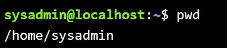  

- Перейдіть до кореневого каталогу та визначте Ваш поточний робочий каталог (дві команди);
    
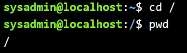  

- Перегляньте вміст поточного каталогу у довгому форматі (скористайтесь відповідним ключем команди ls);
    
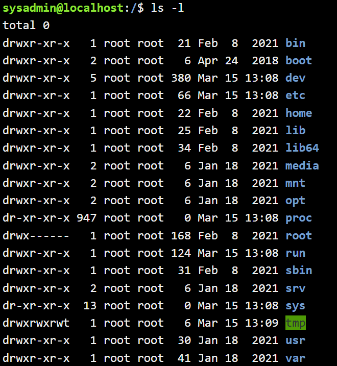  

- Перейдіть до каталогу /usr/share та визначте Ваш поточний робочий каталог (дві команди)
    
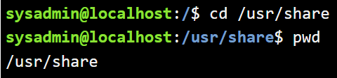  

- Перегляньте вміст поточного каталогу включаючи і приховані файли (hidden files) (скористайтесь відповідним ключем команди ls);
    
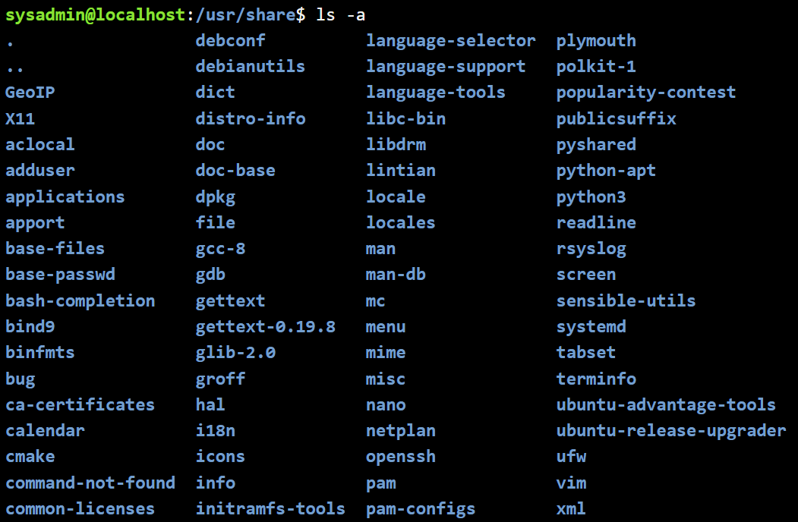  

- \*Перейдіть до каталогу /etc;
    
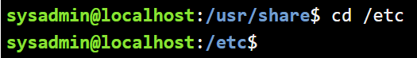  

- \*Перегляньте вміст даного каталогу, але щоб виводило тільки назви файлів, що починаються з літери вашого імені;
    
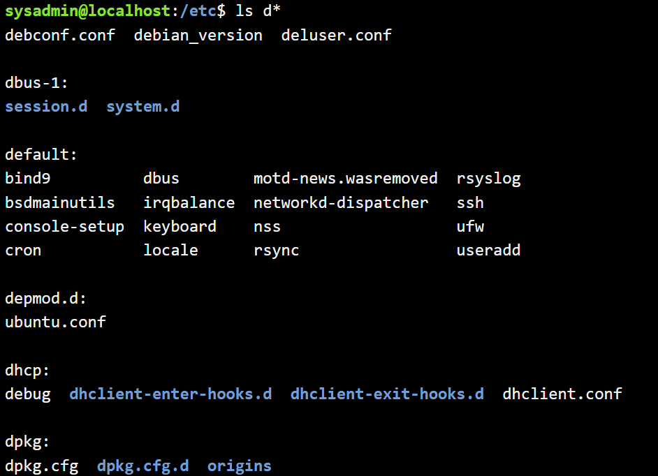  

- \*Перегляньте вміст даного каталогу, але щоб виводило тільки файли, назви яких складаються з 6 літер;
    
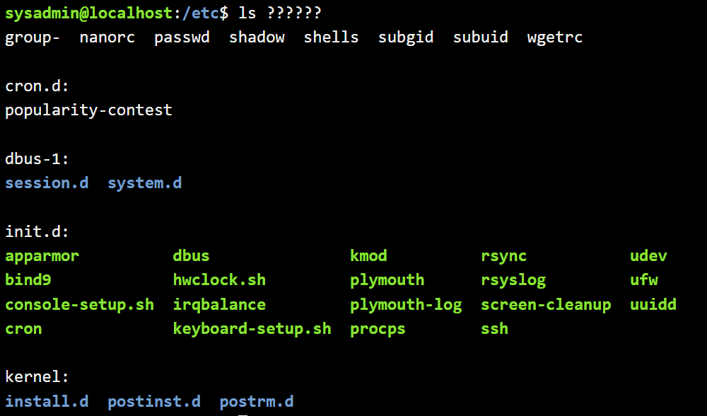  

- \*\*Перегляньте вміст даного каталогу, але щоб виводило тільки файли, назви яких закінчуються на літери ваших імен, наприклад якщо ваші імена Ivan, Anna, Maks, то вибірку робиму, щоб назви файлів закінчувались на літери \[i,a,m\];
    
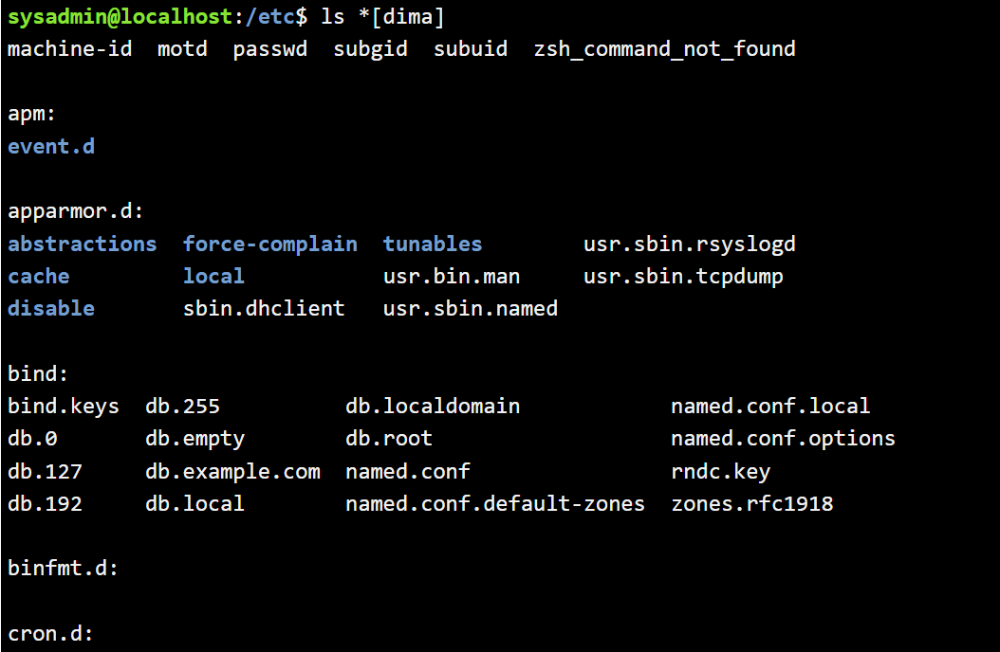  

- \*\*Перейдіть до домашнього каталогу поточного користувача та перегляньте його вміст у рекурсивному (зворотному до алфавітного) форматі (виконати цю дію через конвеєр команд);  

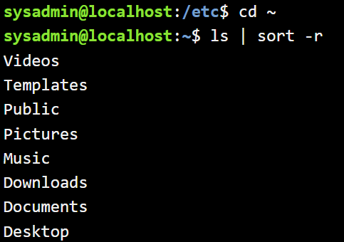  

- В поточній директорії створити директорію з назвою вашої групи;  
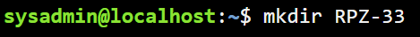    

- Переглянути оновлений вміст домашнього каталогу поточного користувача. Скористайтесь ключем \-r команди ls, яку інформацію ви отримаєте?  

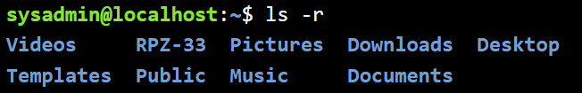  

- Перейдіть у створену вами директорію з назвою Вашої групи та створіть у ній порожній файл *lab5*  

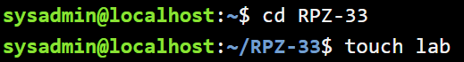  

- Створити в даній директорії 3 директорії з прізвищами студентів вашої команди *surname1, surname2, surname3* (команда mkdir мульти аргумента, тому всі три каталоги можна створити однією командою);  
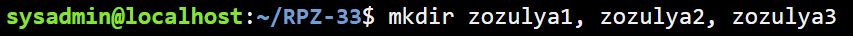  

- Перейдіть у перший підкаталог *surname1* та створіть порожній файл з ім'ям першого студента *name1*;  

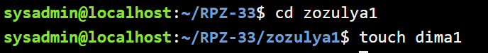    

- За допомогою команди *echo "Hello, my name is Name1" \> name1* внесіть у цей файл дані про студента (символ *\>* дозволяє вивід команди *echo* перенаправити одразу у файл *name1*;  

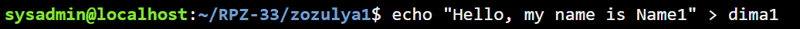  

- Перегляньте вміст файлу *name1* за допомогою команди *cat name1* (має містити щойно введену Вами інформацію)  

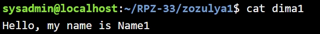  

- Зробіть копію першого файлу *name1* та перейменуйте її у файл з другим ім'ям студенту Вашої команди *name2*;  

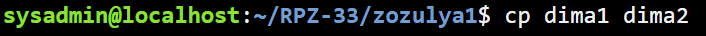  

- Перегляньте вміст каталогу, обидва файли мають з'явитися;  

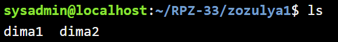   

- Перегляньте вміст другого файлу *cat name2* (він має поки що містити повну копію вмісту файлу *name1*)  

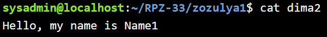    

- Замініть зміст файлу name2, щоб він містив відповідне ім'я другого студента за допомогою команди *echo "Hello, my name is Name2" \> name2*  

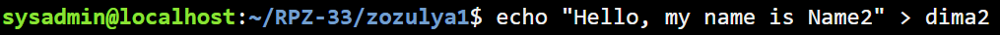  

- Перегляньте вміст другого файлу *cat name2* (він вже має містити оновлену інформацію)  

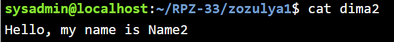  

- Перемістіть файл *name2* у директорію *surname2*;  

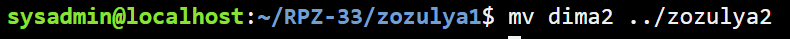  

- Зробіть копію першого файлу *name1* та перейменуйте її у файл з третім ім'ям студенту Вашої команди *name3*;  

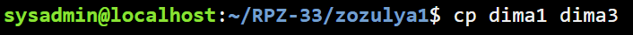  

- Перемістіть файл *name3* у директорію *surname3*;  

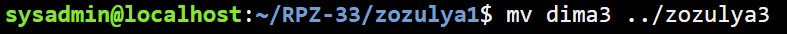  

- Перейдіть до директорії  *surname3;*  

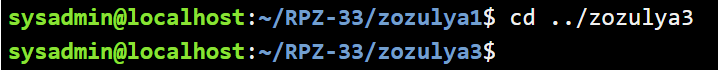  

- Перегляньте вміст третього файлу командою *cat name3* (він має містити дані про другого студента)  

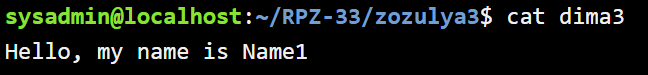  

- Замініть зміст файлу name3, щоб він містив відповідне ім'я третього студента за допомогою команди *echo "Hello, my name is Name3" \> name3*  

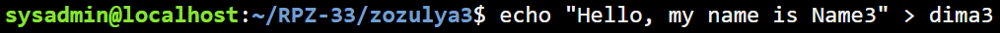  

- Перегляньте вміст файлу за допомогою  *cat name3* (він вже має містити оновлену інформацію)  

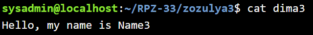   

- Поверніться до домашнього каталогу користувача;  

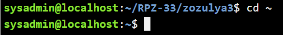  

- \*\*Перегляньте вміст даного каталогу, але щоб виводило тільки Ваш підкаталог з назвою групи та весь його вміст (підкаталоги *surname1, surname2, surname3* та файли *name1, name2, name3*) до того ж файли та катлоги були відкоремлені кольорами (скористайтесь відповідним ключем \-R команди ls та не забудьте використати спеціальний glob-шаблон \[імя каталогу\])  

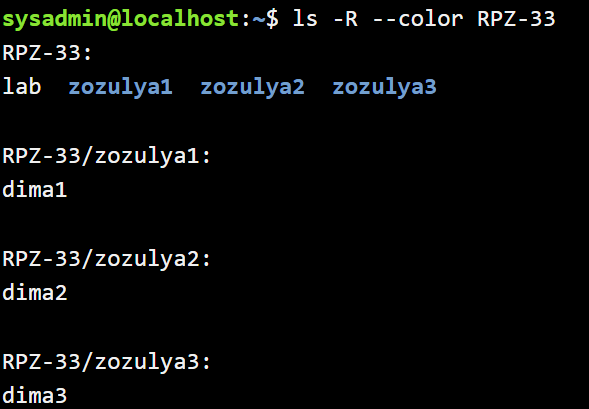

**Примітка:** Назви підкаталогів *surname1, surname2, surname3* та файлів *name1, name2, name3* замініть на свої.  

---

## **5. Опишіть дії, які виконують команди для переміщення по системі каталогів:**

- **команда `cd /`**  
Команда виконує перехід у кореневий каталог файлової системи Linux. Це початкова точка всієї ієрархії каталогів.

- **команда `cd /home`**  
Команда виконує перехід у каталог `/home`, де розміщені домашні каталоги користувачів системи.

- **команда `cd ~`**  
Команда виконує перехід у домашній каталог поточного користувача.

- **команда `cd` (без аргумента)**  
Ця команда також виконує перехід у домашній каталог поточного користувача.

- **команда `cd ..`**  
Команда виконує перехід на один рівень вище, тобто у батьківський каталог відносно поточного.

- **команда `cd ../..`**  
Команда виконує перехід на два рівні вище від поточного каталогу.

- **команда `cd -`**  
Команда виконує перехід до попереднього каталогу, у якому користувач знаходився до останньої зміни каталогу.

---

## **Контрольні запитання:**

### **1. Як можна переглянути шлях до домашньої директорії користувача за допомогою команди echo? Існує 2 способи, наведіть обидва приклади у терміналі (відповідь є у матеріалах академії cisco на сайті netacad.com)**

Шлях до домашньої директорії користувача можна переглянути двома способами:

```bash
echo $HOME
```

```bash
echo ~
```

---

### **2. \*Чи можна переглянути вміст кореневого каталогу, перебуваючи у домашньому каталозі користувача без переходу у кореневий каталог? Продемонструйте це в командному рядку.**

Так, можна переглянути вміст кореневого каталогу без переходу до нього.

```bash
ls /
```

---

### **3. \*Яким чином в терміналі можна додати інформацію в порожній файл?**

Інформацію в порожній файл можна додати за допомогою команди `echo` та оператора перенаправлення `>`.

```bash
echo "Hello, world" > file.txt
```

---

### **4. \*\*Як скопіювати та видалити існуючий каталог? Чи буде відмінність в командах, якщо каталог буде не порожній при цьому**

Для копіювання існуючого каталогу використовується команда:

```bash
cp -r folder1 folder2
```

Параметр `-r` означає рекурсивне копіювання, тобто копіювання каталогу разом з усім його вмістом.

Для видалення непорожнього каталогу використовується команда:

```bash
rm -r folder
```

Якщо каталог порожній, то його можна видалити також командою:

```bash
rmdir folder
```

Отже, відмінність є: для непорожнього каталогу потрібне рекурсивне видалення.

---

### **5. \*\*У якому з наведених нижче прикладів відбувається переміщення файлу? його перейменування? одночасно обидві дії?**

- `mv /work/tech/comp.png /Desktop`  
У цьому прикладі відбувається **переміщення файлу** з каталогу `/work/tech` у каталог `/Desktop`.

- `mv /work/tech/comp.png /work/tech/my_car.png`  
У цьому прикладі відбувається **перейменування файлу**, оскільки файл залишається в тому самому каталозі, але змінює назву.

- `mv /work/tech/comp.png /Desktop/computer.png`  
У цьому прикладі відбувається **одночасно переміщення і перейменування файлу**, тому що файл переноситься в інший каталог і отримує нову назву.

---

## **Conclusion**

During this laboratory work, the basic Bash commands for navigating the Linux file system and managing files and directories were studied. The practical tasks helped to develop skills in moving through the directory structure, viewing directory contents, creating files and folders, copying and moving files, and deleting directories. As a result, practical experience in working with the Linux command line interface was gained.
