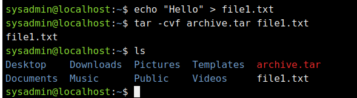
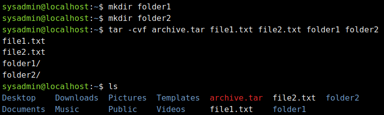
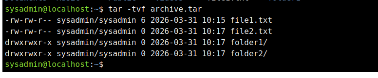
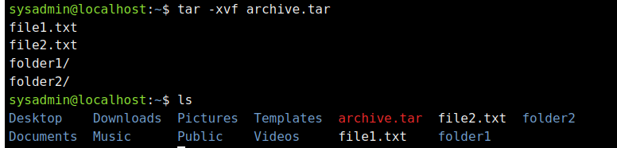
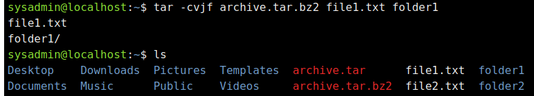
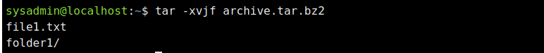
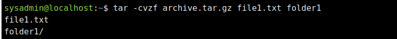
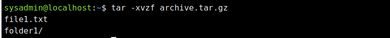

# Тема: “Команди Linux для архівування та стиснення даних. Робота з текстом”

## Мета роботи:

1. Отримання практичних навиків роботи з командною оболонкою Bash.  
2. Знайомство з базовими командами для архівування та стиснення даних.  
3. Знайомство з базовими діями при роботі з текстом у терміналі.

## Матеріальне забезпечення занять:
1. ЕОМ типу IBM PC.  
2. ОС сімейства Windows та віртуальна машина Virtual Box (Oracle).  
3. ОС GNU/Linux (будь-який дистрибутив).  
4. Сайт мережевої академії Cisco netacad.com та його онлайн курси по Linux

---

## Завдання для попередньої підготовки:

### 1. Словник термінів

| Term | Definition |
|-----|-----|
| Compression | The process of reducing the size of a file using algorithms. |
| Archiving | Combining multiple files into a single file for storage or transfer. |
| Lossless Compression | A method of compression that allows the original data to be fully restored. |
| Lossy Compression | A method that reduces file size by permanently removing some data. |
| gzip | A fast compression tool that uses the DEFLATE algorithm. |
| bzip2 | A compression tool that provides better compression but works slower than gzip. |
| xz | A compression tool that achieves very high compression ratios but requires more time and memory. |

---

## Теоретичні відповіді

**Яке призначення команд tar, xz, zip, bzip2, gzip?**  
tar - архівує файли в один файл без стискання; gzip - швидко стискає файли (.gz); bzip2 - стискає краще, але повільніше (.bz2); xz - дає найменший розмір, але найповільніший (.xz); zip - архівує і стискає одночасно (.zip).

**Основні параметри та встановлення**  
tar: -c (створити), -x (розпакувати), -t (перегляд), -f (файл); gzip: -d (розпакувати), -1…-9 (рівень); bzip2: -d, -k; xz: -d, -e; zip: -r (рекурсивно). Встановлення: `sudo apt install tar gzip bzip2 xz-utils zip`.

**Приклади архівування і стискання**  
tar czvf archive.tar.gz folder  
tar cjvf archive.tar.bz2 folder  
tar cJvf archive.tar.xz folder

**Яке призначення команд cat, less, more, head, tail?**  
cat - виводить весь файл; less - перегляд з прокруткою; more - простий перегляд посторінково; head - показує початок файлу; tail - показує кінець файлу.

**Основні параметри та встановлення**  
head: -n (рядки); tail: -n, -f (слідкування); less: зручна навігація; more: базовий перегляд. Встановлення: `sudo apt install coreutils less`.

**Поясніть принципи роботи каналів, потоків та фільтрів**  
Потоки: stdin (ввід), stdout (вивід), stderr (помилки). Канали (|) передають результат однієї команди в іншу. Фільтри — команди, що обробляють дані в потоці.

**Яке призначення команди grep?**  
grep — шукає текст за шаблоном у файлах або потоках, основні параметри: -i (ігнор регістру), -r (рекурсивно), -n (номер рядка).

---

## Хід роботи

### Таблиця команд

| Назва команди | Її призначення та функціональність |
|-----|-----|
| mkdir mybackups | Створення нової директорії **mybackups** у домашньому каталозі користувача |
| tar -cvf mybackups/udev.tar /etc/udev | Команда tar використовується для об’єднання кількох файлів |
| tar -tvf mybackups/udev.tar | Перегляд вмісту архіву |
| tar -xvf mybackups/udev.tar | Розпакування архіву |
| cat mymessage | Виводить вміст файлу |
| echo "Greetings" > mymessage | Записує текст у файл |
| find ~ -name "*bash*" | Шукає файли |
| find /etc -name hosts | Шукає файл |
| tr a-z A-Z | Перетворює текст |
| ls -l /etc \| more | Перегляд по сторінках |
| cut -d: -f1 /etc/passwd | Виводить перше поле |
| more /etc/passwd | Перегляд |
| less /etc/passwd | Розширений перегляд |
| tail /etc/passwd | Останні рядки |

---

### 3. Ознайомтесь з командою tar та за її допомогою виконати у терміналі наступні дії:

- створити файл з розширенням .tar  
  `tar -cvf archive.tar file1`

- створити файл з розширенням .tar, що складається з декількох файлів і каталогів одночасно  
  `tar -cvf archive.tar file1 dir1 dir2`

- перегляду вмісту файлу  
  `tar -tvf archive.tar`

- витягти вміст файлу tar  
  `tar -xvf archive.tar`

- створити архівний файл tar, стиснений за допомогою bzip  
  `tar -cjvf archive.tar.bz2 folder`

- витягти вміст файлу tar bzip  
  `tar -xjvf archive.tar.bz2`

- створити архівний tar файл, стиснений за допомогою gzip  
  `tar -czvf archive.tar.gz folder`

- витягти вміст файлу tar gzip  
  `tar -xzvf archive.tar.gz`

---

### Перенаправлення потоків

| Команда | Що виконує команда? |
|-----|-----|
| cmd 1> file | Перенаправляє stdout у файл |
| cmd > file | stdout у файл |
| cmd 2> file | stderr у файл |
| cmd >> file | додає stdout |
| cmd &> file | stdout + stderr |
| cmd > file 2>&1 | обидва потоки у файл |
| cmd >> file 2>&1 | додає обидва |
| cmd 2>&1 > /dev/null | stdout у null, stderr у stdout |
| cmd 2> /dev/null | ігнорує помилки |
| cmd1 \| cmd2 | передає дані |
| cmd1 2>&1 \| cmd2 | передає все |

---

### Аналіз команд

| Команда | Що виконує команда? | Який потік перенаправлення? |
|-----|-----|-----|
| echo "It is a new story." > story | Запис тексту | stdout |
| date > date.txt | Запис дати | stdout |
| cat file1 file2 file3 > bigfile | Об'єднання файлів | stdout |
| ls -l >> directory | Додавання у файл | stdout |
| sort < file1_unsorted > file2_sorted | Сортування | stdin + stdout |
| find -name '*.txt' > file.txt 2> /dev/null | Пошук без помилок | stdout + stderr |
| cat file1_unsorted \| sort > file2_sorted | Сортування | pipe |
| cat myfile \| grep student \| wc -l | Підрахунок | pipe |

---

## Контрольні запитання

## Контрольні запитання

### 1. Надайте порівняльну характеристику процесам стискання та архівування.
Архівування — це процес об'єднання кількох файлів і каталогів в один файл для зручності зберігання або передачі. Стиснення — це процес зменшення розміру файлів за допомогою спеціальних алгоритмів. Архів може існувати без стиснення, як у випадку з tar, або поєднувати обидва процеси, наприклад у форматах tar.gz чи zip.

### 2. Які програми, окрім наведених в роботі, можуть використовуватись для стискання та архівування файлів та каталогів в ОС Linux? Наведіть приклади та їх короткий опис.
В операційній системі Linux існує багато альтернативних програм для архівування та стиснення. Наприклад, 7zip (p7zip) є універсальним архіватором із високим ступенем стиснення, rar використовується для роботи з популярним форматом RAR, compress є одним із старіших інструментів UNIX, а lzma забезпечує високий рівень стиснення завдяки ефективному алгоритму.

### 3. Порівняйте алгоритми стискання, що використовуються в командах (програмах), використовуваних в Linux. Які з алгоритмів можна вважати найшвидшим та найефективнішим?
Різні алгоритми стиснення мають свої особливості. Алгоритм gzip є найшвидшим, але забезпечує середній рівень стиснення. Алгоритм bzip2 працює повільніше, проте дозволяє отримати кращий коефіцієнт стиснення. Алгоритм xz забезпечує найвищий рівень стиснення, однак працює значно повільніше і потребує більше ресурсів. Таким чином, gzip є найшвидшим, а xz — найефективнішим.

### 4. Опишіть програмні засоби для стискання та архівування, що можуть бути використані у вашому мобільному телефоні.
На мобільних пристроях також доступні інструменти для архівування та стиснення. Наприклад, ZArchiver підтримує велику кількість форматів архівів і дозволяє створювати та розпаковувати файли. Програма RAR є офіційним додатком для роботи з архівами формату RAR. Також існує 7Zipper, який дозволяє працювати з архівами формату 7z та іншими популярними форматами.

### 5. Опишіть та порівняйте програмні засоби для стискання та (де)архівування даних у ОС сімейства Windows.
В операційних системах Windows найбільш поширеними є WinRAR, 7-Zip та вбудований засіб роботи з ZIP-архівами. WinRAR є зручним і функціональним інструментом з широкою підтримкою форматів. 7-Zip є безкоштовним і забезпечує високий рівень стиснення. Вбудований архіватор Windows простий у використанні, але має обмежений функціонал. Загалом, 7-Zip вважається найбільш ефективним, тоді як WinRAR — найбільш зручним.

### 6. Поясніть яким чином стиснення та архівування даних може бути використано для резервування даних. В яких ще задачах системного адміністрування воно може бути використано.
Стиснення та архівування широко використовуються для резервного копіювання даних, оскільки дозволяють зменшити обсяг інформації та об’єднати багато файлів в один архів. Це спрощує зберігання та передачу резервних копій. Також ці процеси застосовуються для перенесення даних між системами, зберігання журналів (логів), а також для розгортання програмного забезпечення та систем.

### 7. Яке призначення директорії файлу /dev/null?
Файл /dev/null є спеціальним системним файлом, у який можна перенаправити будь-які дані, після чого вони безповоротно зникають. Його часто використовують для ігнорування виводу програм або приховування повідомлень про помилки.

---

## Conclusion

During the work, practical skills were acquired in working with archiving, compression, and text processing commands in Linux. I/O streams and their redirection were introduced.
