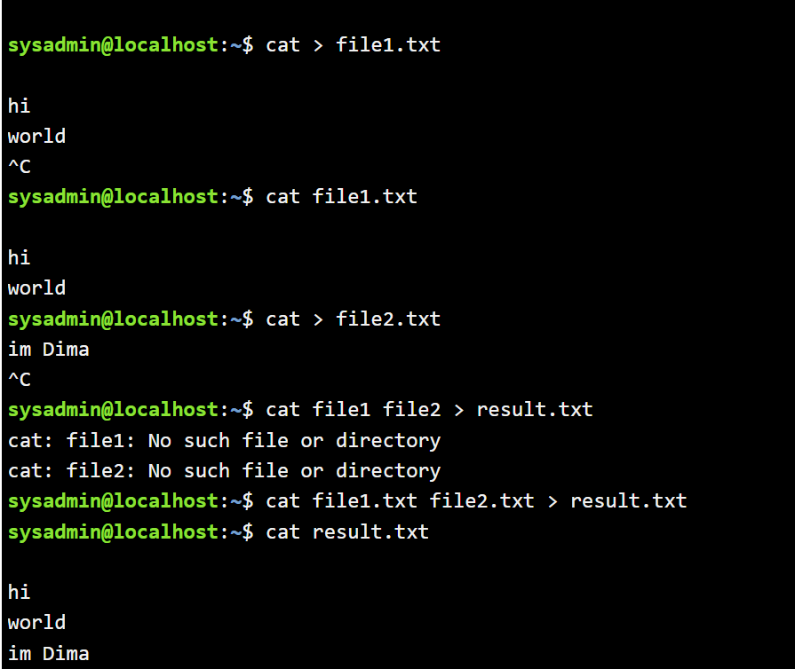
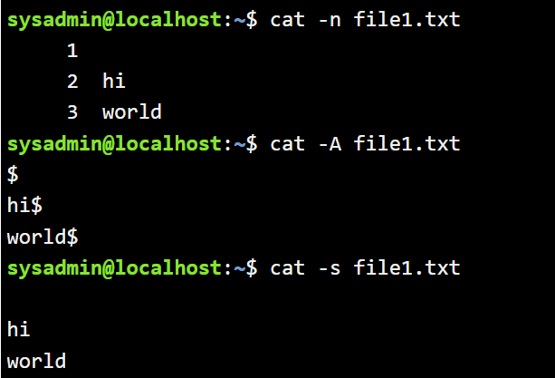
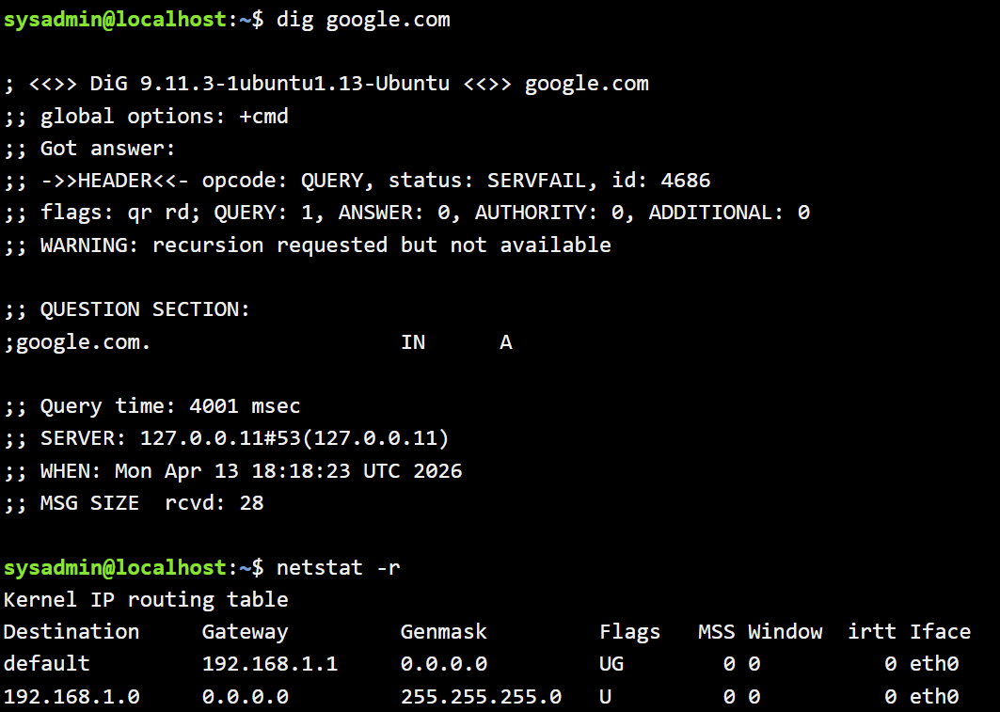

# Лабораторна робота №8  
## Тема: “Збереження службових даних системи та її мережева конфігурація”

## Мета роботи:

1. Отримання практичних навиків роботи з командною оболонкою Bash.  
2. Знайомство з базовими структурами для збереження системних даних - процеси, память, лог-файли  та повідомлення про стан ядра.  
3. Знайомство зі стандартом FHS.  
4. Знайомство з діями при налаштуванні мережі.

---

## Завдання для попередньої підготовки:

1. *Прочитайте короткі теоретичні відомості до лабораторної роботи та зробіть невеликий словник базових англійських термінів з питань призначення команд та їх параметрів.*

### Словник термінів

| Термін | Визначення |
|--------|-----------|
| Bash | Командна оболонка для виконання команд у Linux |
| Kernel | Ядро операційної системи |
| Process | Запущена програма |
| PID | Ідентифікатор процесу |
| Filesystem | Файлова система |
| FHS | Filesystem Hierarchy Standard |
| Log file | Файл журналу |
| Daemon | Фоновий процес |
| Network interface | Мережевий інтерфейс |
| IP address | Унікальна мережева адреса |

---

2. Вивчіть матеріали онлайн-курсу академії Cisco “NDG Linux Essentials”:  
- Chapter 13 - Where Data is Stored  
- Chapter 14 - Network Configuration  

3. Пройдіть тестування у курсі NDG Linux Essentials за такими темами:  
- Chapter 13 Exam  
- Chapter 14 Exam  

---

4. На базі розглянутого матеріалу дайте відповіді на наступні питання:

### 4.1 Розкрийте поняття “псевдо файлової системи”, для чого воно потрібно системі?

Псевдо файлова система — це спеціальна файлова система, яка не зберігає інформацію на фізичному носії, а створює її динамічно. Вона використовується для доступу до інформації про ядро, процеси та пристрої. Наприклад, каталоги `/proc` та `/sys` дозволяють отримати інформацію про стан системи в реальному часі.

---

### 4.2 Чому користувачі не так часто звертаються на пряму до каталогу /proc, яким чином з нього можна отримати інформацію?

Користувачі не часто працюють напряму з `/proc`, оскільки дані там представлені у сирому вигляді та не завжди зрозумілі. Зазвичай використовуються команди `ps`, `top`, `free`, які автоматично обробляють ці дані та відображають їх у зручному вигляді.

---

### 4.3 *Яке призначення файлів /proc/cmdline, /proc/meminfo та /proc/modules?

Файл `/proc/cmdline` містить параметри завантаження ядра.  
Файл `/proc/meminfo` відображає детальну інформацію про використання пам’яті.  
Файл `/proc/modules` містить список завантажених модулів ядра.

---

### 4.4 *Яке призначення команди free?

Команда `free` використовується для перегляду інформації про використання оперативної пам’яті та swap. Вона показує загальний обсяг пам’яті, використаний, вільний і кешований.

---

### 4.5 *Для чого потрібні лог-файли, наведіть приклади їх застосування?

Лог-файли потрібні для збереження інформації про роботу системи, помилки та події. Вони використовуються адміністраторами для аналізу роботи системи, виявлення помилок та контролю безпеки. Прикладом є каталог `/var/log`.

---

### 4.6 **Яке призначення файлу /var/log/dmesg?

Файл `/var/log/dmesg` містить повідомлення ядра, що виникають під час завантаження системи. Він допомагає діагностувати апаратні проблеми.

---

### 4.7 **Для чого розроблено FHS?

FHS розроблено для стандартизації структури файлової системи Linux, щоб забезпечити однакове розташування файлів у різних дистрибутивах.

---

### 4.8 **Які основні команди є у Linux для перегляду та конфігурації мережі

Основними командами є `ifconfig`, `ip`, `ping`, `netstat`, `ss`, `traceroute`. Вони дозволяють переглядати мережеві параметри та діагностувати з’єднання.

---

## Хід роботи:

### 1. Початкова робота в CLI-режимі в Linux ОС сімейства Linux:

1.1 Запустіть операційну систему Linux Ubuntu.  
1.2 Виконайте вхід в систему та запустіть термінал.  
1.3 Запустіть віртуальну машину Ubuntu_PC.  
1.4 Запустіть свою операційну систему Linux та відкрийте термінал.

---

### 2. Опрацюйте всі приклади команд

| Назва команди | Її призначення та функціональність |
|-----|-----|
| `su` | Змінює користувача |
| `ls /proc` | Переглядає каталог `/proc` |
| `cat /proc/1/cmdline; echo` | Виводить параметри процесу |
| `ps -p 1` | Інформація про процес |
| `cat /proc/cmdline` | Параметри ядра |
| `ping localhost > /dev/null` | Перевірка мережі |
| `jobs` | Фонові процеси |
| `fg %1` | Передній план |
| `bg %1` | Фоновий режим |
| `kill %3` | Завершення процесу |
| `killall ping` | Завершення процесів |
| `top` | Моніторинг |
| `sleep 888888 &` | Фоновий процес |
| `ps` | Список процесів |
| `kill PID` | Завершення процесу |
| `pkill -15 sleep` | Завершення |
| `ps -e` | Всі процеси |
| `ps -o pid,tty,time,%cpu,cmd` | Детальна інформація |

---

### 3. Виконайте практичні завдання у терміналі

Команда `cat` використовується для перегляду, створення та об’єднання файлів.

Для створення файлу використовується `cat > file.txt`.  
Для перегляду `cat file.txt`.  
Для об’єднання `cat file1 file2 > result.txt`.

Параметри:  
`cat -n` — нумерація рядків  
`cat -A` — недруковані символи  
`cat -s` — видалення пустих рядків  

Команда `dig` використовується для DNS-запитів, наприклад `dig google.com`.  

Команда `netstat` показує мережеву статистику, наприклад `netstat -r`.

---

## Контрольні запитання:

**1. Як пов'язані між собою команди cat та tac?**

Команди `cat` та `tac` є інструментами для роботи з текстовими файлами, які виконують протилежні дії. Команда `cat` виводить вміст файлу у звичайному порядку — від першого рядка до останнього, а також може використовуватись для створення або об’єднання файлів. У свою чергу, команда `tac` виводить вміст файлу у зворотному порядку — від останнього рядка до першого. Це особливо корисно при роботі з лог-файлами, де важливі останні записи.

---

**2. Що робить команда ss?**

Команда `ss` використовується для перегляду інформації про мережеві сокети в системі. Вона дозволяє отримати дані про відкриті мережеві з’єднання, порти, протоколи, а також процеси, які використовують мережу. Команда є більш сучасною та швидшою альтернативою `netstat`, оскільки працює безпосередньо з ядром операційної системи.

---

**3. В чому відмінність між командами ps --forest та pstree?**

Команда `ps --forest` відображає процеси у вигляді дерева, додаючи візуальну ієрархію до стандартного списку процесів. Вона дозволяє побачити зв’язки між батьківськими та дочірніми процесами у текстовому форматі. Команда `pstree` спеціально призначена для відображення процесів у вигляді дерева і робить це більш наочно, показуючи повну ієрархію процесів у компактному вигляді.

---

**4. У яких каталогах зберігаються налаштування системи?**

Налаштування системи в Linux зберігаються переважно у каталозі `/etc`. У цьому каталозі знаходяться конфігураційні файли операційної системи та встановлених програм. Саме тут можна знайти налаштування мережі, користувачів, служб та інших компонентів системи.

---

**5. У яких каталогах можна знайти встановлені в системі програми, доступні для користувача?**

Програми, доступні для звичайного користувача, зазвичай розміщуються у каталогах `/usr/bin` та `/usr/local/bin`. У цих директоріях зберігаються виконувані файли програм, які можуть бути запущені користувачем без прав адміністратора.

---

**6. У яких каталогах можна знайти встановлені системні програми і програми призначені для виконання суперкористувачем?**

Системні програми та утиліти для адміністратора зазвичай знаходяться у каталогах `/sbin` та `/usr/sbin`. Ці програми призначені для виконання системних операцій і часто потребують прав суперкористувача для запуску.

---

**7. Поясніть призначення команд ping, ifconfig, traceroute.**

Команда `ping` використовується для перевірки доступності іншого вузла в мережі та визначення часу затримки передачі даних. Команда `ifconfig` застосовується для перегляду та налаштування параметрів мережевих інтерфейсів, таких як IP-адреса та маска підмережі. Команда `traceroute` дозволяє визначити маршрут, яким проходять пакети до іншого вузла, показуючи всі проміжні точки мережі.

---

**8. Як називаються мережеві інтерфейси в Linux?**

Мережеві інтерфейси в Linux мають назви, такі як `eth0` для дротових підключень та `wlan0` для бездротових. У сучасних системах також використовуються нові формати назв, наприклад `enp0s3` або `wlp2s0`, які більш точно відображають фізичне розташування пристрою.

---

**9. Як за допомогою команди ifconfig вивести параметри тільки одного мережевого інтерфейсу (наприклад, eth1), а не всіх?**

Щоб вивести інформацію лише про один мережевий інтерфейс, потрібно вказати його ім’я після команди. Наприклад, команда `ifconfig eth1` покаже параметри тільки інтерфейсу `eth1`, не відображаючи інші інтерфейси системи.

---

## Conclusion

During the laboratory work, the structure of system data storage and network configuration in Linux was studied. The functionality of pseudo filesystems such as /proc and /sys was analyzed, along with practical usage of commands for process and network management. The work significantly improved practical skills in Bash and understanding of Linux system architecture.
