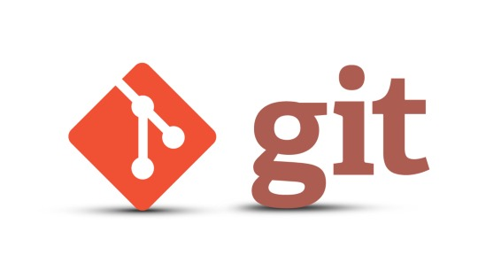
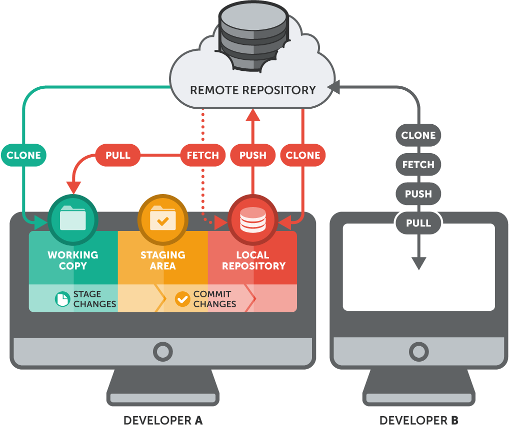
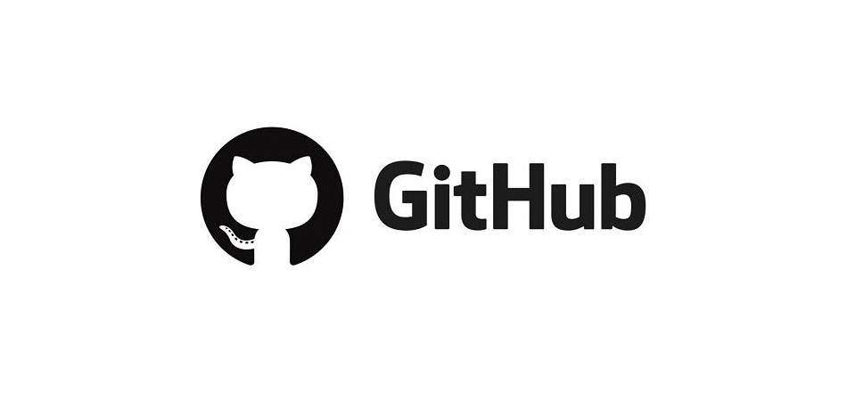

# WORK-CASE-1  
# Git: система контролю версій та її використання

**Git** — це **розподілена система контролю версій**, яка використовується для відстеження змін у файлах під час створення програмного забезпечення, вебсайтів, навчальних проєктів та інших цифрових продуктів. Вона дозволяє **зберігати історію розвитку проєкту**, повертатися до попередніх версій та організовувати зручну **спільну роботу** над одним продуктом.

Git був створений у 2005 році Лінусом Торвальдсом для розробки операційної системи Linux. Основною вимогою було створити систему, яка могла б швидко працювати з великою кількістю файлів, підтримувати роботу багатьох розробників одночасно та надійно зберігати історію змін. Завдяки своїй швидкості, надійності та зручності Git швидко став стандартом у розробці програмного забезпечення.

Сьогодні Git використовується як у невеликих студентських роботах, так і у великих міжнародних проєктах, де над продуктом працюють сотні або навіть тисячі розробників. Практично кожна сучасна ІТ-компанія використовує Git у своїй роботі.

  

Головною причиною використання Git є можливість **зберігати повну історію змін у проєкті**. Кожна зміна фіксується, що дозволяє повернутися до попереднього стану файлів у разі появи помилок або невдалих змін. Це забезпечує **безпеку роботи** та дозволяє експериментувати без ризику втратити результат.

Git також значно спрощує **командну роботу**. Кожен учасник команди може виконувати власні зміни незалежно від інших, після чого всі зміни поєднуються у спільну версію проєкту. Це дозволяє паралельно працювати над різними частинами програми без конфліктів.

Крім цього, Git дозволяє зберігати копії проєктів на спеціальних серверах, що забезпечує **резервне зберігання даних** та дозволяє продовжувати роботу з різних комп’ютерів без втрати результатів. Завдяки цьому розробник може почати роботу вдома, а продовжити її в навчальному закладі або на роботі.

  

Принцип роботи Git полягає у створенні спеціального сховища проєкту, яке називається **репозиторієм**. У ньому система зберігає історію змін файлів, інформацію про різні версії проєкту та всі етапи його розвитку. Кожне збереження стану проєкту створює окрему точку в історії, до якої можна повернутися у будь-який момент.

Під час роботи користувач змінює файли, після чого ці зміни зберігаються у системі разом із коротким описом виконаної роботи. Таким чином формується **повна історія розвитку проєкту**, що дозволяє аналізувати всі етапи роботи, відстежувати виправлення помилок та контролювати розвиток програмного продукту.

  

Репозиторії можуть зберігатися **локально** на комп’ютері користувача або розміщуватися на **віддалених серверах** для спільної роботи команди. Віддалені репозиторії дозволяють організувати спільну роботу над кодом, обмін змінами між розробниками та створювати резервні копії проєктів.

Для цього використовуються спеціальні сервіси, такі як **GitHub**, **GitLab** або **Bitbucket**, які надають можливість зберігати репозиторії в Інтернеті, керувати доступом користувачів, переглядати історію змін та автоматизувати процес розробки.

  

Git широко застосовується у **розробці програмного забезпечення**, створенні вебсайтів, мобільних застосунків, ігрових проєктах, навчальних роботах студентів та корпоративних інформаційних системах. Він дозволяє організувати стабільний процес розробки, уникати втрати даних та забезпечувати контроль над розвитком проєкту.

Система також використовується у відкритих проєктах з відкритим кодом, де тисячі розробників з різних країн можуть одночасно покращувати програмне забезпечення.

  

Використання Git дає змогу **безпечно тестувати нові ідеї**, швидко знаходити та виправляти помилки, відновлювати попередні версії проєкту, працювати в команді без втрати даних та зберігати копії проєкту у хмарних сервісах. Це робить Git одним із найважливіших інструментів сучасної розробки.

Опанування Git є важливою навичкою для майбутніх програмістів, оскільки більшість компаній використовують його у своїй щоденній роботі.

  

---
**Комміт (commit)** — це збереження поточного стану файлів у репозиторії Git у певний момент часу. По суті, комміт є знімком проєкту, який фіксує всі зміни, внесені у файли з моменту попереднього збереження.

Кожен комміт містить інформацію про те, які саме файли були змінені, хто зробив зміни, коли вони були виконані та короткий опис виконаної роботи. Завдяки цьому формується послідовна історія розвитку проєкту.

Комміти дозволяють відслідковувати зміни у файлах, оскільки система зберігає різницю між версіями файлів. Розробник може переглянути, що саме було змінено, повернутися до попереднього стану або порівняти різні версії проєкту між собою.
---
Отже, **Git є ключовим інструментом сучасної розробки програмного забезпечення**. Він дозволяє контролювати зміни у файлах, організовувати спільну роботу, зберігати історію розвитку проєкту та забезпечувати стабільність створення програмних продуктів.

---

## Корисні ресурси та джерела інформації

Офіційний сайт Git:  
https://git-scm.com/

Платформа для хостингу репозиторіїв GitHub:  
https://github.com/

Платформа для спільної розробки GitLab:  
https://about.gitlab.com/

Навчальний ресурс Git Book:  
https://git-scm.com/book/uk/v2

Інтерактивне навчання Git:  
https://learngitbranching.js.org/

Документація GitHub:  
https://docs.github.com/
