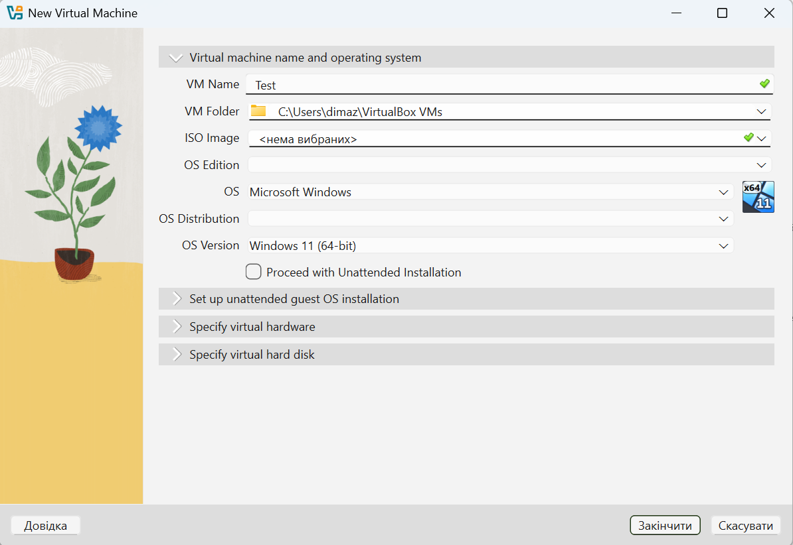
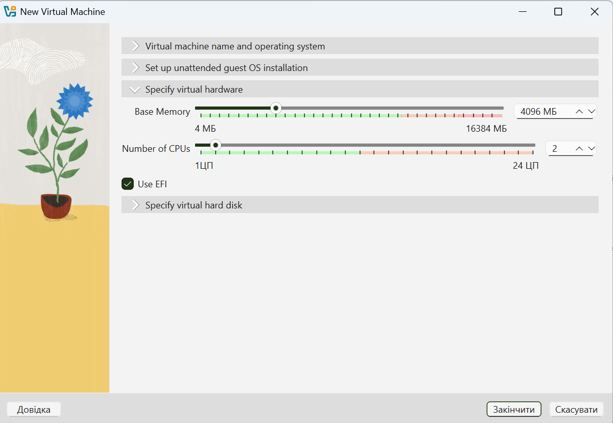
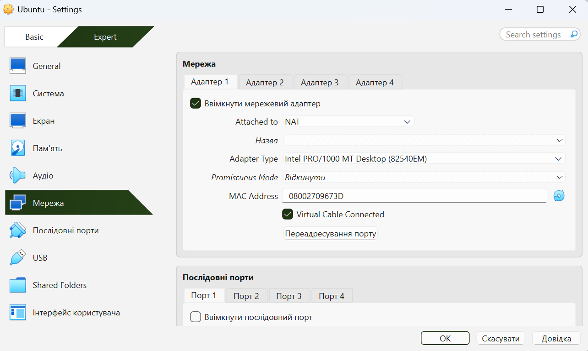
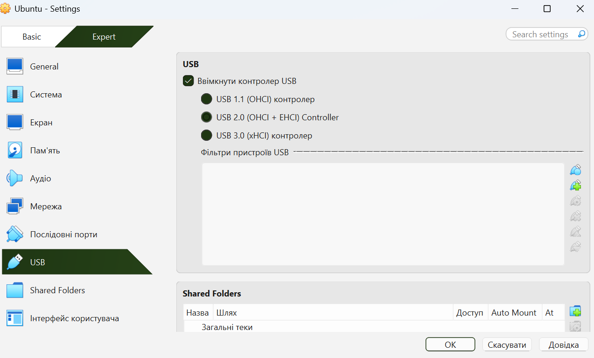
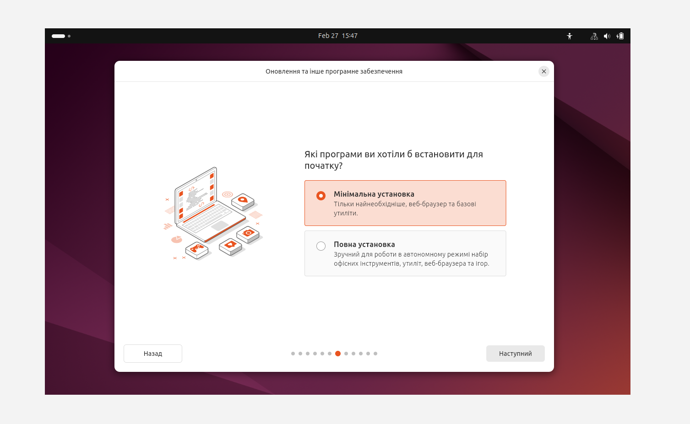
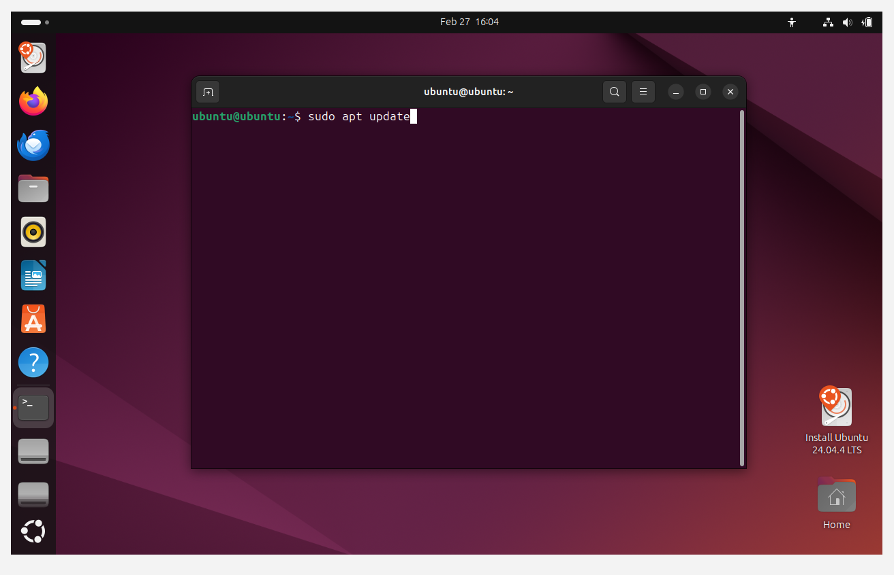

# WORK-CASE-2
# Type II Hypervisor – Virtual Box

# Description of basic actions in Virtual Box

- **Creating a new virtual machine**

Creating a new virtual machine is done via the New button in VirtualBox. You need to specify the name, type and version of the operating system, then allocate RAM and create or connect a virtual hard disk.

- **Selecting/adding equipment available to the virtual machine**

In the virtual machine settings, you can change the number of processors, the amount of RAM, video memory, add or change the type of disk controller, connect an ISO image, configure network adapters and other virtual equipment.

- **Configuring the network and connecting to Wi-Fi points**

In the Network section, the network operation mode is selected - NAT, Bridged Adapter or another type of connection. In Bridged Adapter mode, the virtual machine accesses the same network as the host OS, allowing Wi-Fi connectivity.

- **External media (flash memory) support**

The USB section in the virtual machine settings is used to work with flash memory. After connecting a USB device to the host, it can be transferred to the guest system via the Devices - USB menu.

# Installing a virtual machine

# Conclusion

During this work, the basic functionality of the Type II hypervisor VirtualBox was studied and practically tested. The process of creating a new virtual machine, configuring its hardware resources, setting up network connectivity, and working with external media was analyzed. Special attention was given to installing a GNU/Linux operating system in a virtual environment and configuring the graphical interface.

As a result, practical skills in deploying and managing virtual machines were acquired. VirtualBox proved to be a convenient and flexible tool for virtualization, allowing efficient testing, configuration, and experimentation with operating systems without affecting the host system.
