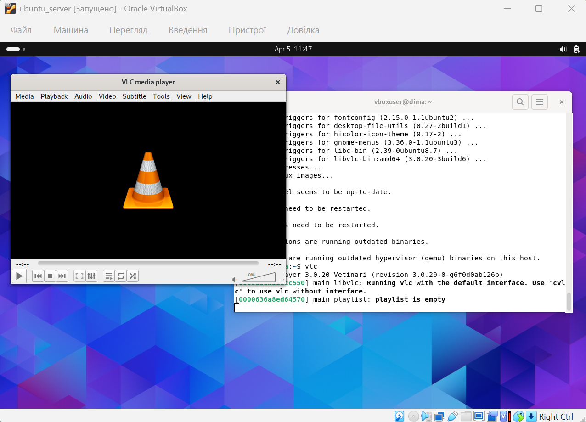
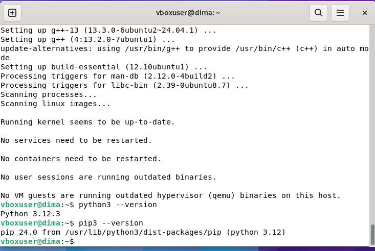
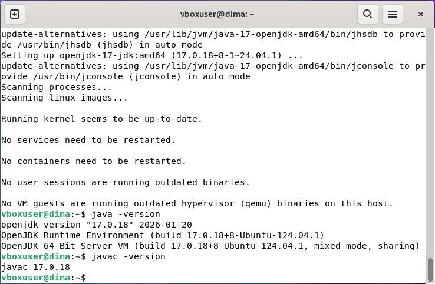

# Work-case 4

## 1. Пакет і репозиторій

**Пакет** — це архівований набір файлів, який містить програму або бібліотеку разом із виконуваними файлами, конфігураціями, залежностями та метаданими (версія, опис тощо).

**Репозиторій** — це централізоване сховище пакетів, з якого система завантажує, встановлює та оновлює програмне забезпечення. Репозиторії можуть бути офіційними або сторонніми.

### Менеджери пакетів у Linux

- **APT** — Менеджер пакетів для Debian та Ubuntu, працює з .deb пакетами, забезпечує просте встановлення, оновлення та видалення програм.
- **DNF** — Менеджер пакетів для Fedora та RHEL, заміна YUM, працює з .rpm пакетами, підтримує автоматичне вирішення залежностей.
- **YUM** — Застарілий менеджер пакетів для систем на основі RPM, використовується у старих версіях RHEL/Fedora.
- **Pacman** — Менеджер пакетів для Arch Linux, працює з пакетами в форматі .pkg.tar.zst, швидкий та простий у використанні.
- **Zypper** — Менеджер пакетів для openSUSE, працює з .rpm пакетами, підтримує репозиторії та автоматичне вирішення залежностей.

---

## 2. Менеджер пакетів (Ubuntu — APT)

### Основні команди

**Оновлення списку пакетів**
```bash
sudo apt update
```

**Оновлення системи**
```bash
sudo apt upgrade
```

**Пошук пакета**
```bash
apt search package_name
```

**Інформація про пакет**
```bash
apt show package_name
```

**Список встановлених пакетів**
```bash
apt list --installed
```

**Встановлення пакета**
```bash
sudo apt install package_name
```

**Видалення пакета**
```bash
sudo apt remove package_name
```

**Повне видалення**
```bash
sudo apt purge package_name
```

**Видалення непотрібних залежностей**
```bash
sudo apt autoremove
```

**Додавання репозиторію**
```bash
sudo add-apt-repository ppa:repo/name
sudo apt update
```

---

## 3. Встановлення програм

### Відео/аудіо плеєр (VLC)
```bash
sudo apt install vlc
```



### Середовище програмування (Python)
```bash
sudo apt install python3 python3-pip
```



### Або Java
```bash
sudo apt install openjdk-17-jdk
```



---

## 4. Встановлення через графічне середовище

**Магазини додатків:**
- Ubuntu Software
- GNOME Software
- KDE Discover

**Кроки встановлення:**
1. Відкрити магазин додатків
2. Ввести назву програми у пошук
3. Натиснути "Install"
4. Ввести пароль (за потреби)
5. Дочекатися завершення встановлення

Ці інструменти дозволяють встановлювати програми без використання терміналу та працюють із системними пакетами, Snap або Flatpak.
