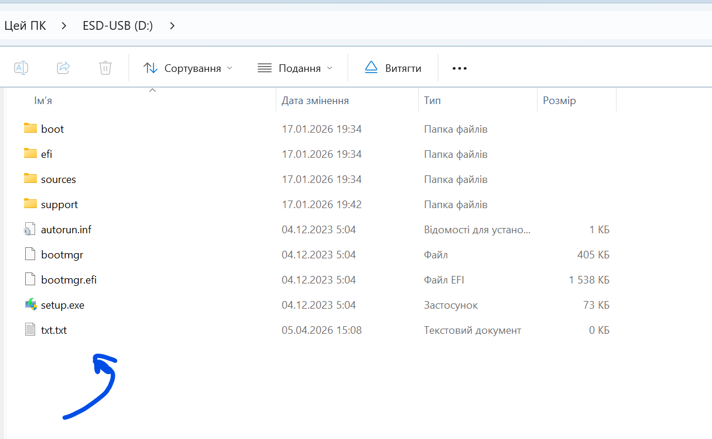
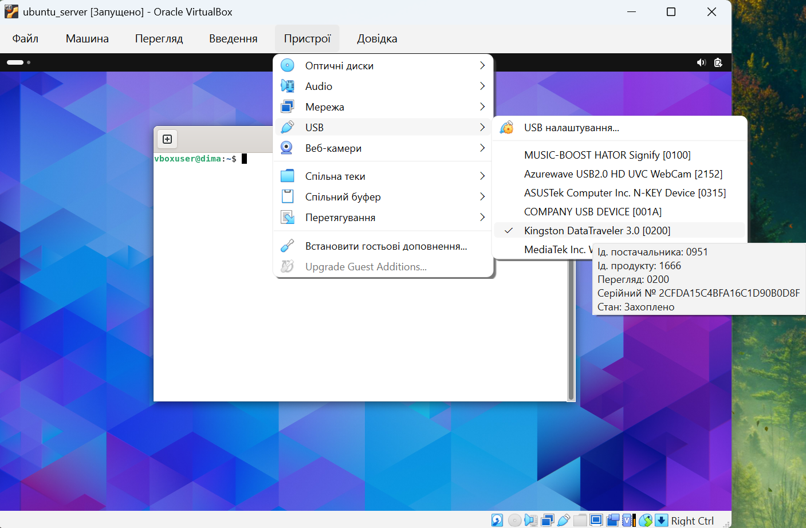
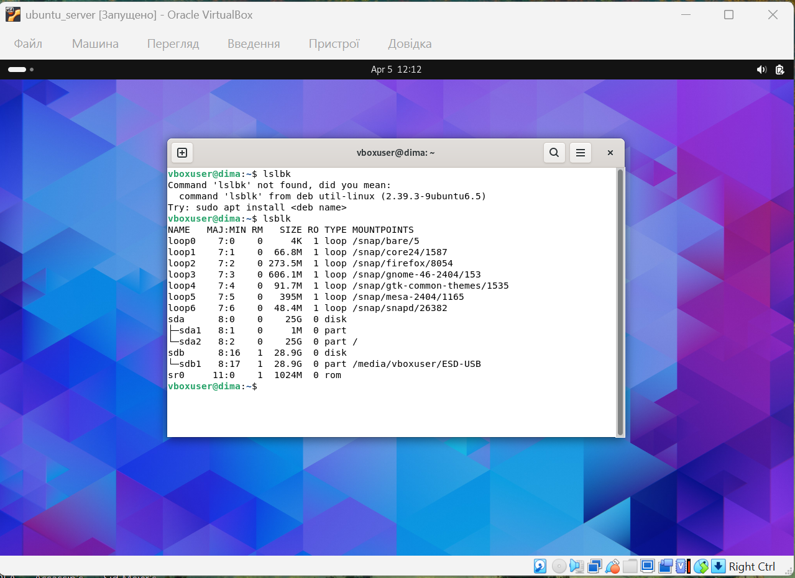
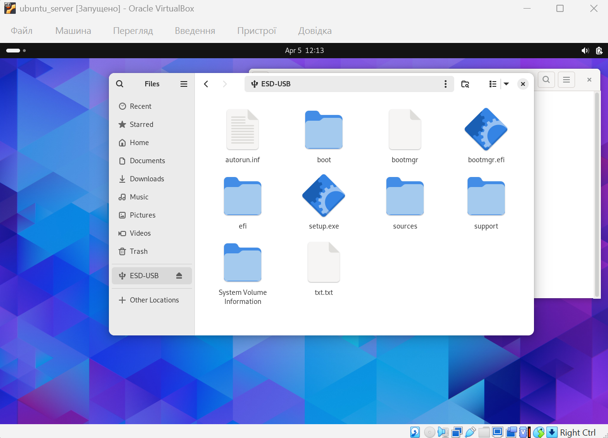

# Work-case 5

| Term            | Definition                                                                 |
|-----------------|--------------------------------------------------------------------------|
| Peripheral Device | An external device connected to a computer, such as a printer or USB drive |
| Mounting        | The process of attaching a storage device to the file system             |
| Block Device    | A type of device that stores data in blocks, such as a hard drive or USB |
| File System     | A method of organizing and storing files on a storage device            |
| CUPS            | A printing system used in Linux to manage printers and print jobs       |
| Driver          | Software that allows the operating system to communicate with hardware  |
| Terminal        | A command-line interface used to interact with the operating system     |
| Command         | An instruction given to the system through the terminal                 |

## 1.

При роботі з персональним комп’ютером часто виникає потреба підключення периферійних пристроїв, таких як принтер або флеш-накопичувач. В операційній системі Linux для роботи з такими пристроями використовується **механізм драйверів, файлової системи та автоматичного визначення пристроїв**.

Наприклад, при підключенні флешки система визначає її як **блочний пристрій** (наприклад, `/dev/sdb1`), після чого виконується її **монтування**.  
**Монтування** — це процес підключення файлової системи пристрою до єдиного дерева каталогів Linux, що дозволяє отримати доступ до файлів.

Зазвичай флешка автоматично монтується у каталог `/media` або `/mnt`, але це також можна зробити вручну за допомогою команди `mount`.  
Принтери у Linux працюють через систему **CUPS (Common Unix Printing System)**, яка відповідає за керування друком, встановлення драйверів і обробку черги друку.

Суть операції монтування полягає у тому, що **фізичний пристрій або розділ диска підключається до певної точки у файловій системі**, після чого користувач може працювати з файлами як зі звичайною папкою.  
Без монтування доступ до даних на пристрої неможливий.

Основна різниця між роботою з периферією у Linux та Windows полягає у підході до організації файлової системи та автоматизації.  
У Windows пристрої автоматично отримують **букву диска** (наприклад, D:, E:), і користувач працює з ними без додаткових дій.  
У Linux всі пристрої інтегруються у **єдину файлову систему через монтування**, що дає більше контролю, але потребує розуміння принципів роботи.  
Також у Linux частіше використовується **термінал**, тоді як у Windows більшість операцій виконується через графічний інтерфейс.

---

## 2.

Для виконання практичної частини необхідно підключити флешку до віртуальної машини через налаштування гіпервізора (наприклад, VirtualBox → Devices → USB).  
Після підключення флешка автоматично з’являється у файловому менеджері Linux, зазвичай у розділі **“Інші розташування”** або у каталозі `/media`.

Через графічний інтерфейс достатньо відкрити флешку, вибрати файл і скопіювати його у домашню папку або на робочий стіл.

Для роботи через термінал спочатку потрібно перевірити підключені пристрої за допомогою команди `lsblk`, знайти флешку (наприклад, `/dev/sdb1`), після чого змонтувати її.  
Далі файл копіюється за допомогою команди `cp`, а для відключення використовується команда `umount`.

Щодо принтера, у графічному інтерфейсі Linux його можна додати через налаштування у розділі **“Принтери”**, після чого виконати друк через стандартне меню.  
У терміналі друк здійснюється командою `lp`, вказавши файл для друку.

## Conclusion

During this work, the principles of connecting and using peripheral devices in Linux were studied. The concept of mounting and its importance in accessing storage devices was analyzed. Practical tasks demonstrated how to work with USB drives and printers using both graphical interface and terminal commands. This experience helps to better understand how Linux interacts with hardware and improves overall system management skills.
