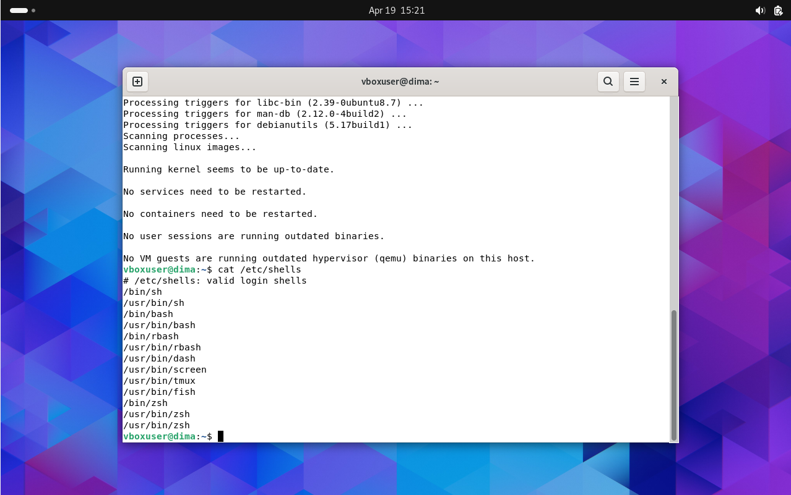
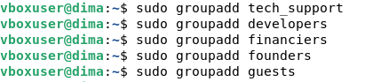
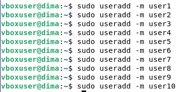
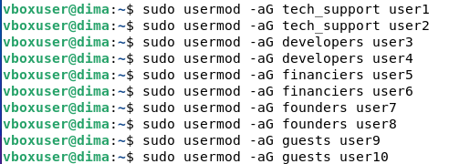
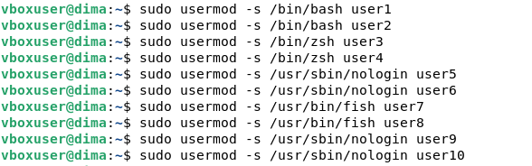
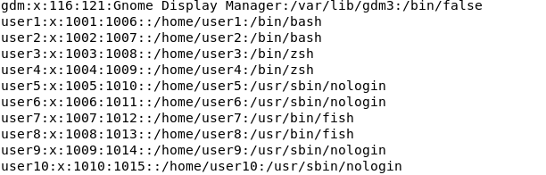
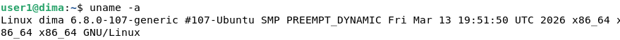
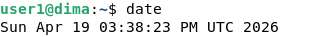
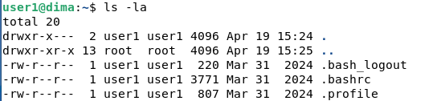
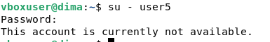

# Work-case 6

## Робота з користувачами та командними інтерпретаторами в Linux

| Term                 | Definition                                                                       |
| -------------------- | -------------------------------------------------------------------------------- |
| Shell                | A program that allows users to interact with the operating system using commands |
| Bash                 | A default Linux shell used for command execution and scripting                   |
| Zsh                  | An advanced shell with improved features like auto-completion                    |
| Fish                 | A user-friendly shell with built-in suggestions and highlighting                 |
| Command              | An instruction given to the system via terminal                                  |
| Terminal             | A text-based interface for interacting with the system                           |
| Root                 | The superuser with full administrative privileges                                |
| Sudo                 | A command used to execute actions with administrative rights                     |
| Permission           | Rights that define access to files and system resources                          |
| File system          | The structure used by the OS to store and organize data                          |
| Directory            | A folder used to organize files                                                  |
| Login                | The process of accessing a system with credentials                               |
| Logout               | The process of exiting a user session                                            |
| useradd              | A command used to create a new user                                              |
| groupadd             | A command used to create a new group                                             |
| usermod              | A command used to modify user settings                                           |
| passwd               | A command used to change a user password                                         |
| su                   | A command used to switch to another user                                         |
| nologin              | A setting that prevents a user from logging in                                   |
| /etc/passwd          | A system file that stores user account information                               |
| /etc/shells          | A file that lists available command shells                                       |
| which                | A command that shows the path of an executable                                   |
| uname                | A command that displays system information                                       |
| date                 | A command that shows current date and time                                       |
| pwd                  | A command that shows the current directory                                       |
| ls                   | A command that lists files and directories                                       |

---

## Мета роботи

Ознайомитися з командними інтерпретаторами Linux, навчитися встановлювати альтернативні оболонки, створювати користувачів, керувати групами та налаштовувати права доступу.

---

# 1. Встановлення командних інтерпретаторів

## Обрані командні інтерпретатори:

* bash (за замовчуванням)
* zsh
* fish

---

## Команди для встановлення

sudo apt update
sudo apt install zsh fish -y

---

## Перевірка встановлення

cat /etc/shells

---

## Короткий опис інтерпретаторів

**Bash (Bourne Again Shell)**
Стандартна оболонка Linux. Підтримує скрипти, змінні, цикли, умови. Використовується для адміністрування системи.

**Zsh (Z Shell)**
Розширена оболонка з автодоповненням, підсвіткою синтаксису, плагінами. Зручна для розробників.

**Fish (Friendly Interactive Shell)**
Зручний інтерпретатор з підказками в реальному часі, автодоповненням без додаткових налаштувань, простий для новачків.

---

# 2. Створення користувачів та груп

## Створення груп

sudo groupadd tech_support
sudo groupadd developers
sudo groupadd financiers
sudo groupadd founders
sudo groupadd guests

---

## Створення користувачів

sudo useradd -m user1
sudo useradd -m user2
sudo useradd -m user3
sudo useradd -m user4
sudo useradd -m user5
sudo useradd -m user6
sudo useradd -m user7
sudo useradd -m user8
sudo useradd -m user9
sudo useradd -m user10

---

## Додавання користувачів до груп

sudo usermod -aG tech_support user1
sudo usermod -aG tech_support user2

sudo usermod -aG developers user3
sudo usermod -aG developers user4

sudo usermod -aG financiers user5
sudo usermod -aG financiers user6

sudo usermod -aG founders user7
sudo usermod -aG founders user8

sudo usermod -aG guests user9
sudo usermod -aG guests user10

---

# 3. Налаштування командних інтерпретаторів

## Перевірка шляхів до shell

which bash
which zsh
which fish
which nologin

---

## Призначення shell для користувачів

### Technical support – bash

sudo usermod -s /bin/bash user1
sudo usermod -s /bin/bash user2

---

### Developers – zsh

sudo usermod -s /bin/zsh user3
sudo usermod -s /bin/zsh user4

---

### Financiers – без доступу

sudo usermod -s /usr/sbin/nologin user5
sudo usermod -s /usr/sbin/nologin user6

---

### Founders – fish

sudo usermod -s /usr/bin/fish user7
sudo usermod -s /usr/bin/fish user8

---

### Guests – без доступу

sudo usermod -s /usr/sbin/nologin user9
sudo usermod -s /usr/sbin/nologin user10

---

## Перевірка

cat /etc/passwd

---

# 4. Демонстрація роботи користувачів

## Вхід під користувачем

su - user1

---

## Приклади команд

### Системна інформація

uname -a

---

### Дата і час

date

---

### Поточний каталог

pwd

---

### Вміст каталогу

ls -la

---

## Перевірка обмежених користувачів

su - user5

---

# Conclusion

During this work, the process of installing additional command interpreters, creating users and distributing them to groups was considered. Different shells were configured for different categories of users, and access was also restricted for individual groups. The acquired skills allow you to effectively manage user access in a Linux system and increase the level of security.
